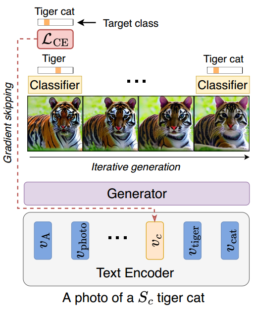

[toc]

> [Discriminative Class Tokens for Text-to-Image Diffusion Models](https://arxiv.org/abs/2303.17155)
>
> [official code](https://github.com/idansc/discriminative_class_tokens)

# 贡献

- 可以看做将 **classifier guidance 和 textual inversion 的思路结合**了一下，避免了训练一个能对带噪声图像进行分类的分类器的麻烦

# 思路

## Framework

- 提出的思路比较直接，**找一个专用的 classifier，然后使用 cross entropy** 回传梯度
- 论文中主要针对了“一词多义”和“带有形容词”的提示词进行提升，所以并不是将一个 object 替换为了 placeholder，而是**在 object 前插入一个 token** (e.g. 上图中的 $S_c$)；而后续的训练也**只会对这个 token 进行更新**