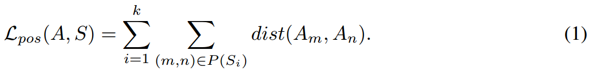
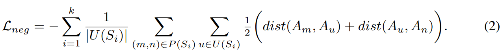
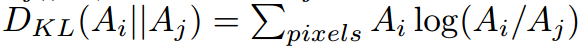
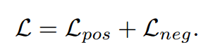
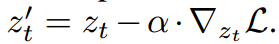

[toc]

> [Linguistic Binding in Diffusion Models: Enhancing Attribute Correspondence through Attention Map Alignment](https://arxiv.org/abs/2306.08877)
>
> [official code](https://github.com/RoyiRa/Linguistic-Binding-in-Diffusion-Models)

# 贡献

- 对提示词中的 adj 和 noun 提取为二元组；**让同个二元组中 adj 和 noun 对应的 attn map 尽量接近，让不同的尽量远离**

# 思路

## Framework

- ”正样本“计算公式为，$A$ 表示 attn map，

  

- ”负样本“计算公式为，

  

- $dist$ 使用 KL 散度计算，

  

- 更新方式和 Attend-and-Excite 一致

  > 这种更新方式 “负样本” 中可以出现负值

  

  

  