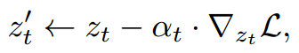

[toc]

> [Divide & Bind Your Attention for Improved Generative Semantic Nursing](https://arxiv.org/abs/2307.10864)
>
> [official code](https://github.com/boschresearch/Divide-and-Bind)

# 贡献

- 使用 **TV (Total Variation)**，引导扩散模型**在 attn map 中产生多个“高亮”区域**，从而尽可能保证”高亮”区域的数量多于 object 的数量，<u>*以保证 object 都出现在图像中*</u>
- 使用 **Jensen–Shannon divergence 监督 adj 和 noun 对应的 attn map 尽量接近**

# 思路

## Preliminary

- TV (Total Variation)，**值越大表示函数图像起伏越剧烈**，值越小表示越平滑

## Framework

- $A$ 之间求差就是 TV 计算方式的变体，

  

  简言之，TV 作为损失函数可以视作是<u>*要求 attn map 中尽量出现多个“峰值”，i.e. 产生多个“高亮”区域*</u>

  优化方式仍然使用 Attend and Excite 提出的方法，所以 $-\min$ 表示**模型尽量不要向着 “变平滑” 的方向移动**

  > 理论上应该也可以换成 $+\max$？不过使用 Attend and Excite 更新方式的好像都用的是 $-\min$ 这种更新思路，可能是某种经验？

- JS divergence 本质也是利用 KL divergence 来计算的，$A^r$ 表示 adj token、$A^s$ 表示 subject token，

  

- 优化使用 Attend and Excite 的思路，

  

  