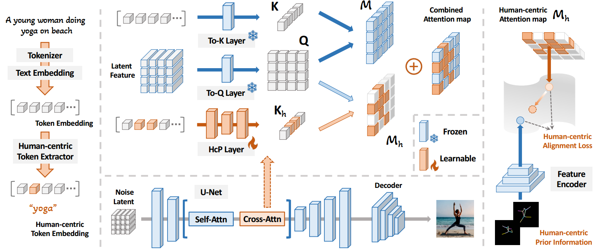
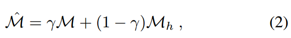
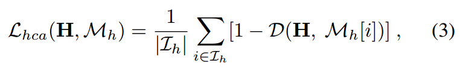
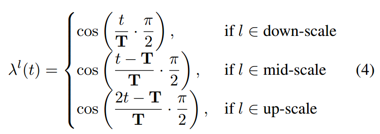
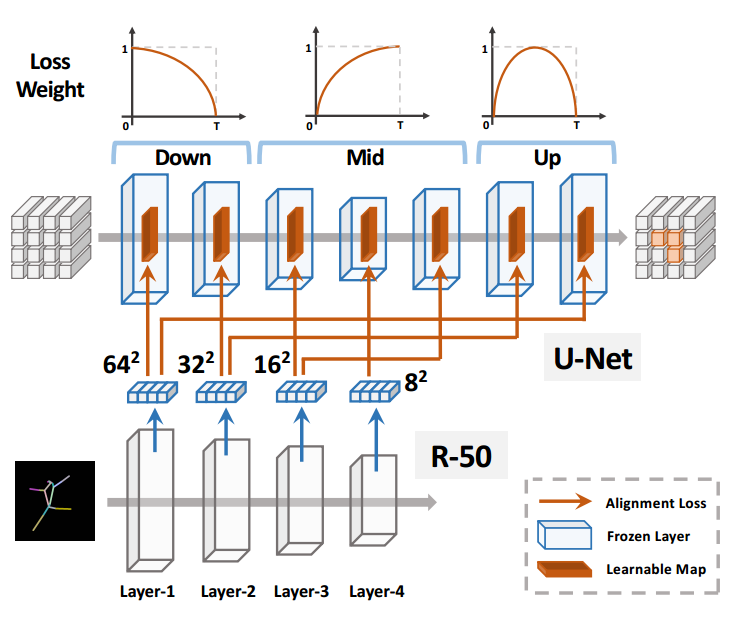
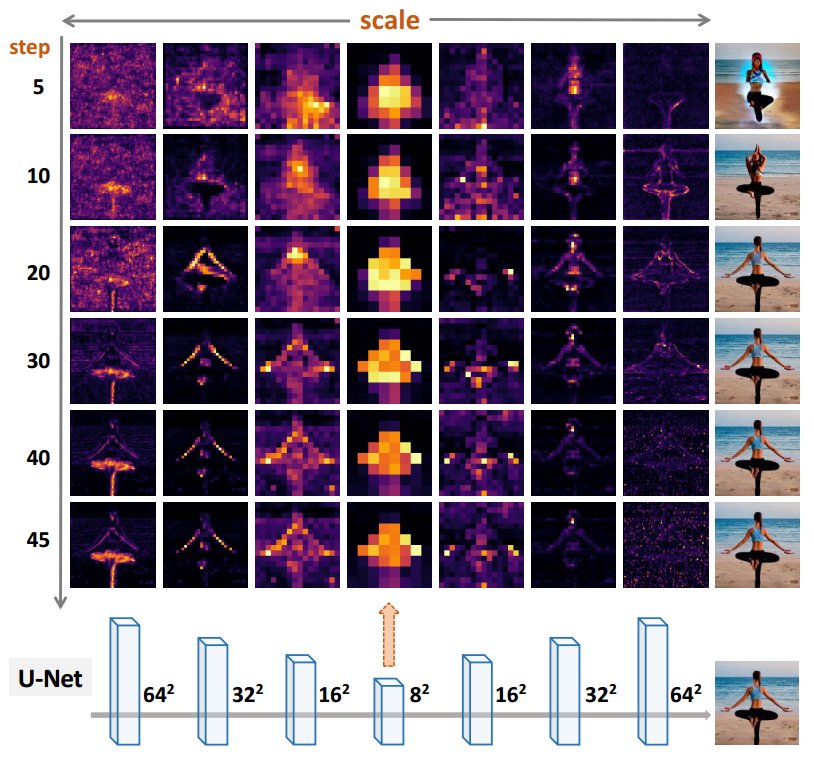

[toc]

> [Towards Effective Usage of Human-Centric Priors in Diffusion Models for Text-based Human Image Generation](https://arxiv.org/abs/2403.05239)
>
> [official code](https://github.com/hcplayercvpr2024/hcplayer)

# 贡献

- 使用 **cross attn map 来引入控制信息**；为**控制信息额外形成一个 attn map，然后和原始的 attn map 相加融合**
- 论文中分析了**不同时间步，和不同分辨率中 attn map** 的关注程度，提出了一个**自适应的损失函数权重函数**

# 思路

## Framework

- 论文中主要针对的任务是复杂人体姿态的生成 (e.g. yoga)

- 额外输入一个 $K_h$，e,g. A young woman doing yoga on beach 中的 yoga, woman，来自于一个 HcP Layer (本质是一个 MLP)

- attn map 通过相加融合，

  

- **损失函数**

  

  - $D$ 代表 cosine similarity；$I_h$ 表示 $K_h$ 中的“关键词”对应的下标 (e.g. yoga 和 woman 的下标)

  > 原文：We then utilize a pre-trained encoder, such as ResNet50, to extract features $\textbf H$ from the corresponding key pose images that provide a reference for humancentric characteristics.
  >
  > 这个预训练模型居然可以提取出 feature 和 attn map 对应上计算相似度，怀疑是不是试了很多模型的 feature map 和 attn map 长得比较像就用了

- **自适应的权重函数**

  

  

  - 对应不同的分辨率 (i.e. downblk, midblk, upblk) 使用不同的权重函数，同一个分辨率对于不同时间步也会自适应选择不同的权重

  > 
  >
  > 论文中通过可视化了各个时间步和分辨率的 attn map 总结得到了上面的公式，但并不是很难看懂是如何总结出来的
  >
  > 原文在 section 3.1 进行了分析