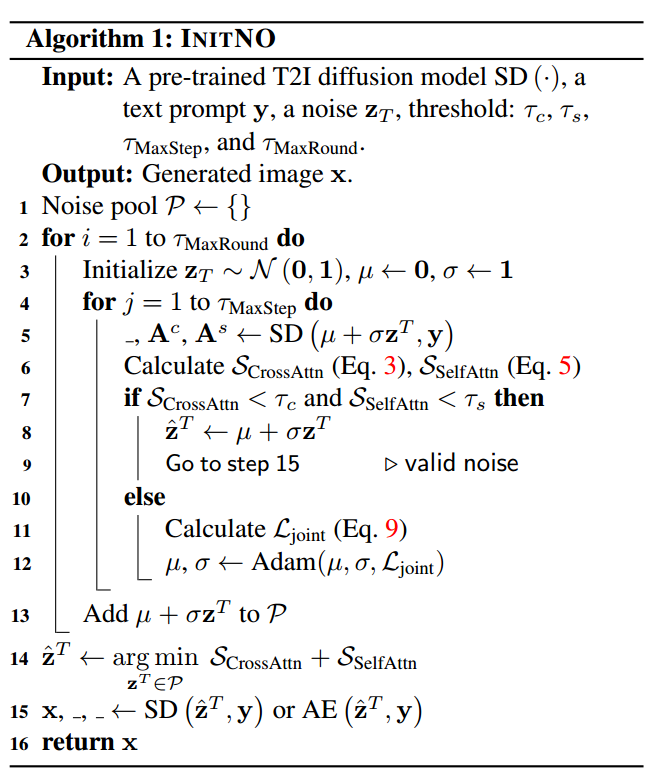

[toc]

> [InitNO: Boosting Text-to-Image Diffusion Models via Initial Noise Optimization](https://arxiv.org/abs/2404.04650)
>
> [official code](https://github.com/xiefan-guo/initno)

# 思路

- 论文提出 cross attn map 和 self attn map 的关注区域会很大程度影响生成图像对提示词的“忠诚度”；**在正式推理前，先推理几个时间步，通过阈值的方式来判别 cross attn map 和 self attn map 是否有较大的机会生成“正确的”图像，否则更新初始噪声**

# 贡献

## Preliminary

- 本论文对 Attend and Excite 可能导致的一些问题进行了分析

- 在 Attend and Excite 中，存在一个 <u>*scalar 对损失函数梯度进行放缩*</u>，而<u>*这个 scalar 对于不同的内容并不稳定*</u>

  

  因此本论文认为在每个时间步的推理中对 $z_t$ 进行优化不一定是最好的选择

  > 但是 Attend-and-Excite 的原文是：For performing our gradient update defined in Equation (3) in the main paper, we set the scale factor $\alpha_t$ using a linear scheduling rate that starts from 20 and decays linearly to a minimum value of 10
  >
  > 理论上这个 scalar 是动态的，但是这篇论文好像把 scalar 固定为 20 了

## Framework

- 论文总结了 2 种生成中出现的问题（1）Subject neglect，由于**某个 subject 在 cross attn map 被忽视** (e.g. crown)（2）Subject mixing，由于**多个 subject 在 self attn map 产生了重叠**

  

- 为了分别解决上述 2 个问题，提出 2 个对应的 loss，

  - 和 Attend and Excite 思路一致，**选择 subject 中最被“忽视”的作为损失函数**；阈值小于 0.2 则认为有可能生成“正确”的图像

    

  - 思路是**对重叠的区域所占比例作为量化指标** (类似 IoU)

    

    分子可以看做是在计算关注区域的交集，而分母则是在计算关注区域的并集；阈值小于 0.3 则认为有可能生成“正确”的图像

  - 在 scale and shift 过程中为了防止过度偏离高斯噪声，增加 KL 散度进行限制

    

  - **完整损失函数**，

    

- **算法流程**，

  

  - 该算法没有使用 Attend and Excite 直接对 $z_t$ 做更新，而是**对初始噪声进行更新**；对初始噪声进行 scale and shift 操作 ($\mu$ 和 $\sigma$)
  - 如果满足需求 (step 7)，那么就进行正常的推理过程 (step 15)
  - 如果不满足，则使用上面提出的损失函数**对 $\mu$ 和 $\sigma$ 进行更新** (step 12)
  - 如果 $\tau_{MaxRound}$ 轮次内都未能找到合适的新噪声，那么选择 $\tau_{MaxRound}$ 中 loss 最小的作为一个“次优”的选择 (step 14)

