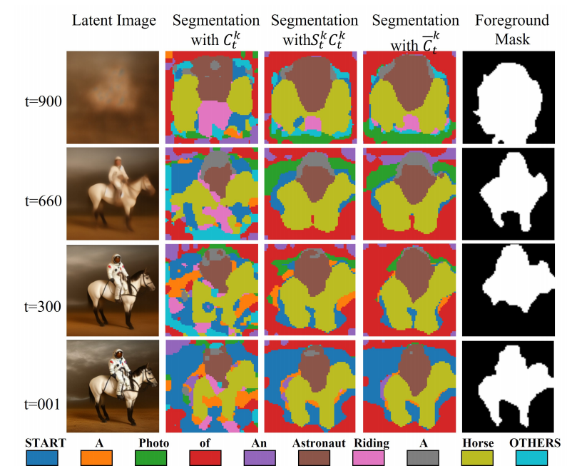
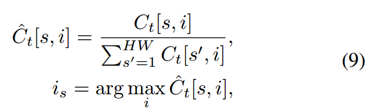
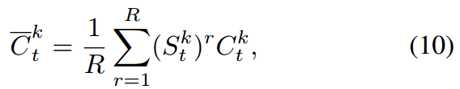
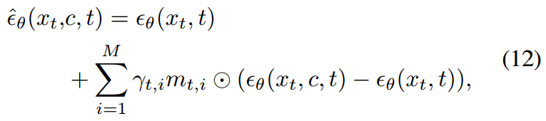
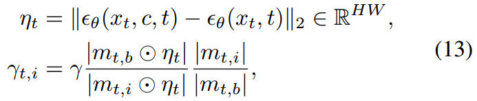
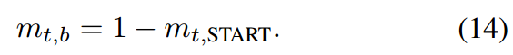

[toc]

> [Rethinking the Spatial Inconsistency in Classifier-Free Diffusion Guidance](https://arxiv.org/abs/2404.05384)
>
> [official code](https://github.com/SmilesDZgk/S-CFG)

# 贡献

- **通过在 spatial 维度 (对 cross attn map 的每列) 进行归一化**，让每个 token 都有获得“关注”的机会 (反之 [SOT] 之类的 token 从头到尾都占据着关注)
- 对归一化后的 cross attn map **利用 self attn map 进行优化** (更清晰的边缘、填补 cross attn map 中的窟窿)
- 将 cross attn map 作为不同 token 的 mask，然后**对不同的 subject 使用不同权重的 CFG**

# 思路

## Framework

- **主要的效果图**

  

- **Cross-Attention-based Semantic Segmentation**

  第一步，通过**在 spatial 维度 (对 cross attn map 的每列) 进行归一化**

  

  > 在 cross attn map 中，对每一列并没有限制总和为 1 (因为只对每行进行 softmax)，直觉上就是对于某些 token 来说可能这一列都是“黑的” (i.e. 这个 token 没有机会被任何一个像素关注)
  >
  > 论文原文：Without the renormalization, Ct would <u>*tend to concentrate most of the attention on a single token*</u>, such as the START token, for all patches, damaging the semantic segmentation.

  第二步是根据上一步被归一化的结果，**重新判断每个像素最关注的是哪个 token**

- **Self-Attention-based Segmentation Completion**

  观察效果图中第三列和第四列，第一行可以看到在“马”对应的 attn map 中存在一些窟窿 (蓝色的小块)，而二、三、四行则是在边缘部分 attn map 有一些混乱

  直觉上，<u>*self attn map 是用于对图像进行“自关注”并优化图像质量*</u>，论文中**将其用于优化 cross attn map**，

  

  > 这个公式来自另一篇论文 Diffusion model is secretly a training-free open vocabulary semantic segmenter

- **Semantic-Aware CFG**

  上面提到 `重新判断每个像素最关注的是哪个 token`，经过这一步后就可以把 attn map 继续当做 mask 使用了

  

  公式的核心是 $\gamma_{t,i}$，如果对于所有的 subject 都使用相同的 $\gamma_{t,i}$，就退化为普通的 CFG

  

  <u>*$|·|$ 表示将矩阵中每一个元素加在一起*</u>，

  

  效果图最后一列是 SOT token 对应的 mask (猜测应该是做归一化之间的)，**可以较好地捕捉到全局的 mask**，<u>*取反之后就可以作为背景的 mask 使用了*</u>

  > $|m_{t,i}|$ 相当于计算面积，所以这个公式应该是化简后的形式，<u>*面积本来应该是在分母上求平均用的*</u>
  >
  > 直觉上这是将 <u>*background 的生成情况作为了 benchmark*</u>，所以最后得到的是一个比值
  >
  > 但不清楚为什么是 background 作为 benchmark，而且为什么要关注 $\eta_t$ (这个值应该只能反应 condition 对噪声预测的影响强度)