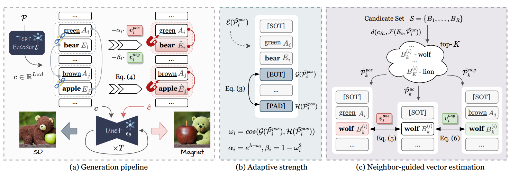

[toc]

> [Magnet: We Never Know How Text-to-Image Diffusion Models Work, Until We Learn How Vision-Language Models Function](https://arxiv.org/abs/2409.19967)
>
> [official code](https://github.com/I2-Multimedia-Lab/Magnet)

# 贡献

- 论文通过大量实验观察了 EOT token 在生成中的作用；结论包括（1）**第一个 EOT 和后续作为 padding 使用的 EOT token 有着不同的作用**（2）**EOT token 主要包含了全局信息**（3）attribute 和 subject 之间的关系越不符合数据集分布 (e.g. blue apple, black sheep)，**EOT token 和 Pad token 之间的相似度降低的越明显**
- 通过实验中的观察，论文提出**通过正、负样本对 subject token 进行更新**，并**由 EOT 和 Pad 之间的相似度决定权重**

# 思路

## Preliminary

- **EOT 的作用**，

  

  直觉上 EOT 和 Pad 都提供了全局的信息

## Framework

> 论文中并没有直接对 EOT token 和 Pad token 进行处理，看起来思路更像是通过修改 subject token 间接“缓解” EOT token 和 Pad token 带来的“错误”

- 准备正、负样本，

  

  $F$ 表示提取 embedding，$E_i$ 表示 subject token，$P$ 表示 prompt；**正样本来自原始的 (attr, subject) 对，负样本则是将其打乱** (2306.08877v3-Syntax Guided Generation 中也有类似的思路)

- 使用自适应权重、利用正负样本**对 subject embedding 进行更新**，

  

  $\omega_i$ 是 EOT token 和最后一个 Pad token 之间的 cosine similarity；直觉上 $\omega_i$ 越小表示 **(attr, subject) 越不符合”常理“ (e.g. blue apple)，就需要权重更大的更新**

  

- 由于 prompt 中只有一个正 subject，论文提出**使用相近的“概念”加强对正负样本的估计**

  > 这部分没有完全理解，参考 3.2 Neighbor-guided vector estimation 章节