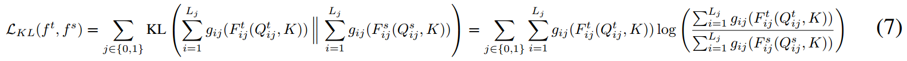
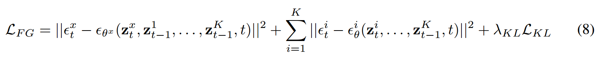

[toc]

> [Adapting Diffusion Models for Improved Prompt Compliance and Controllable Image Synthesis](https://arxiv.org/abs/2410.21638)
>
> [official code](https://github.com/DeepakSridhar/fgdm)

# 贡献

- 通过一种**类似“自回归”的思路，结合 T2I Adapter 的形式，融合注入多个控制信息**

# 思路

## Framework

> ControlNet 和 T2I Adapter 等控制网络是不存在加噪这一步骤的，但是<u>*论文中给出的结构则是将带噪声的隐变量 $z_{t-1}$ 送入 adapter*</u>

**网络结构**

- 根据结构图基本就可以看懂；很像是一种 auto regressive 的方法

**损失函数**

- **对每个控制信息计算重建损失**

- 使用蒸馏的方式，监督 cross attn map

  > 蒸馏使用到 teacher 和 student 网络，这部分不是很了解

  

- 完整的损失函数，

  

