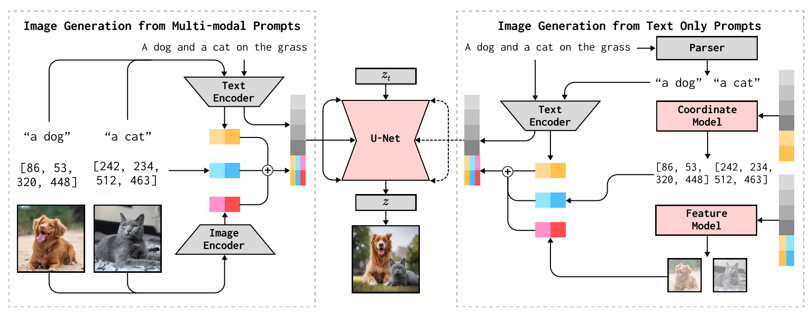
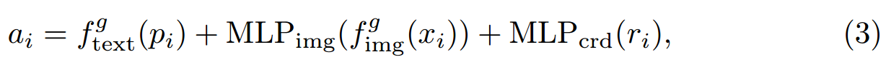

[toc]

> [MultiGen: Zero-shot Image Generation from Multi-modal Prompts](https://www.ecva.net/papers/eccv_2024/papers_ECCV/papers/01296.pdf)

# 贡献

- 将**额外的控制信息通过相加融合形成 special token**，然后在 seq_len 维度 **concat 到 prompt token 后**

  > 有点像不使用 token 替换的 anytext

- 如果某些**控制信息不存在，则训练一些 diffusion model 进行预测补齐**

# 思路

## Framework

**Multi-Modal Augmented Token**

- 通过 MLP 提取出 **special token**

> 新的 token 直接 concat，上图中彩色的部分

**Handling the Missing Modalities**

- 使用 **diffusion model 预测缺少的控制信息**

> 比如原文中提到：When coordinates are not provided, we generate them for augmented tokens to indicate positions of objects. Intuitively, with the text prompt of the image and object-level text, we have sufficient information to generate the coordinates of objects. In this case, <u>*we employ a diffusion model to generate the coordinates*</u> for each object