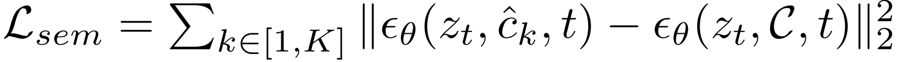

[toc]

> [Token Merging for Training-Free Semantic Binding in Text-to-Image Synthesis](https://arxiv.org/abs/2411.07132)
>
> [official code](https://github.com/hutaiHang/ToMe)

# 贡献

- 通过实验发现了两个现象（1）**EOT token 中蕴含着全局信息**，这种信息本身不具有明显的属性和对象之间的绑定关系，**可能影响生成**正确的图像（2）**attribute embedding 和 subject embedding 的相加融合可以产生一个包含两者信息的 token** (i.e. 具有加和性质)

- 利用上述发现论文提出（1）**将 EOT 包含的属性全局信息去除**（2）**将 attribute 和 subject 融合为一个 token**，从根本上解决了 cross attn map 可能不对齐的问题 (毕竟只有一个 token 就不存在对齐问题了)

# 思路

## Framework

**Token Merging**

- i.e. **将 attribute 和 subject token 相加融合**

**End Token Substitution**

- **使用不包含 attribute 的 prompt 来生成 EOT token** (e.g. 使用 a cat and a dog，去除形容词 wearing glasses、with hat)

**损失函数**

- 使用<u>*原始的 prompt 预测的噪声*</u>作为监督

  > 直觉上作用是确保融合后的 token 正确生成对应的图像

  

- 使用交叉熵监督 <u>*cross attn map 正确反映位置信息*</u>

  

  > 这里使用交叉熵很像是有 mask 作为真值的，但是论文中没有提到
  
- 完整损失函数，

  

  > 论文中没有提到是如何进行参数更新的，论文标题中有 training free，猜测可能还是使用 Attend-and-Excite 的方式