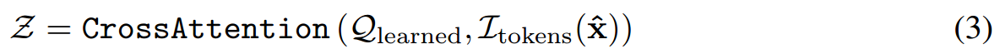

[toc]

> [Hummingbird: High Fidelity Image Generation via Multimodal Context Alignment](https://arxiv.org/abs/2502.05153)

# 贡献

- **引入 BLIP-2 (QFormer) 等 MLLM**，对模型生成图像的一致性进行更细致的监督 (e.g. 数量)

# 思路

## Framework

**提示词提取**

- 使用 MLLM 提取<u>*更细粒度的提示词*</u>

**损失函数**

> 感觉这里的损失函数可能参考了 MLLM 任务中的操作，不是很懂这部分知识

- **Global Semantic Reward**

  > 这里用到了 CLS token，不太清楚作用是什么

  

  

- **Fine-grained Consistency Reward**

  > image-text matching (ITM) classifier，这部分好像也是 MLLM 中的知识

  