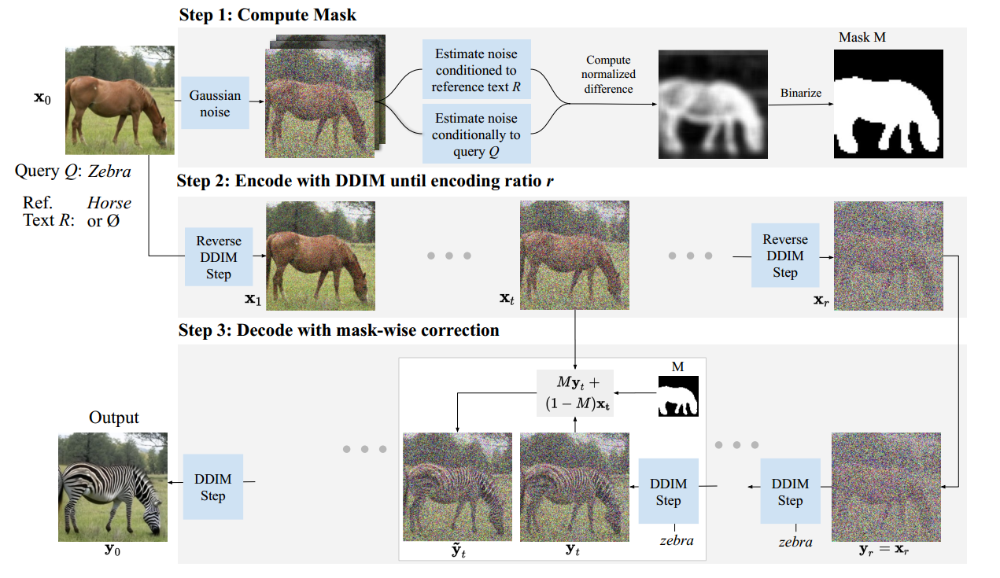
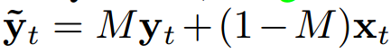
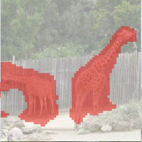
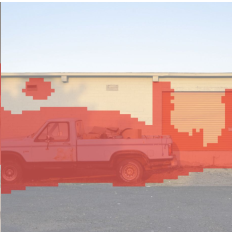

[toc]

> [DiffEdit: Diffusion-based semantic image editing with mask guidance](https://arxiv.org/abs/2210.11427)
>
> [unofficial code](https://github.com/ruilin19/DiffEdit-by-Stable-Diffusion)

# 问题提出

- 之前的模型在编辑上的控制不够细粒度 (比如可以将猫编辑为狗，但是猫原来的姿势可能被破坏)
- 需要用户绘制 mask

# 贡献

- 通过使用不同的 condition 预测到的噪声之间的差距，计算为了达到编辑效果，模型应该关注什么区域
- 结合 inpainting 的思路，利用 mask 平衡编辑和对原图的忠实

# 思路

- 该方法包含以下的步骤，

  1. 对输入图像 $x_0$ 添加一定的噪声 (论文设置加噪强度为 0.5)，然后分别使用 `condition=Q` 和 `condition=R` 进行数次 (论文设置为 10 次) 噪声预测，将**不同 condition 下的两个噪声的差值**的均值，通过 threshold (论文设置 0.5) 得到一个 **0,1 mask**；这个 mask 可以看做<u>*为了达成编辑目标模型需要关注的区域*</u>

  2. 使用**相同的高斯噪声**，加噪到 $x_r$ (i.e. step 2 和 step 3 的初始化 latent 是相同的)，**分别使用 `condition=Q` 和 `condition=R` 进行去噪**；去噪后，下一时间步的 latent 计算公式为，

     

     其中，$y_t$ 使用 `condition=Q`，$x_t$ 使用 `condition=R`

  > 看起来 step1 和 step2,3 之间可以 cache 共用的 latent 来加速？

- 论文发现如果 $x_r$ 中的加噪时间步 $r$ 越大，那么编辑能力越强，但对原图的忠实度越弱

# Limitation

- DiffEdit 使用的 mask 方式需要依赖原图中尽可能“出现”了某个物体，作用类似于占位符，这样才可以较稳定的通过预测噪声的差值来计算 mask；i.e. <u>*DiffEdit 在背景中插入新的物体等任务上表现较差*</u> (因为背景部分的差值在不同 condition 下也不会很大)，同理，DiffEdit 在涉及空间调整的任务上也表现不加 (目标位置很可能并没有被 mask 足够地关注到)

   在两个 mask 间 insert 新的物体失败， 将物体向右移动失败

