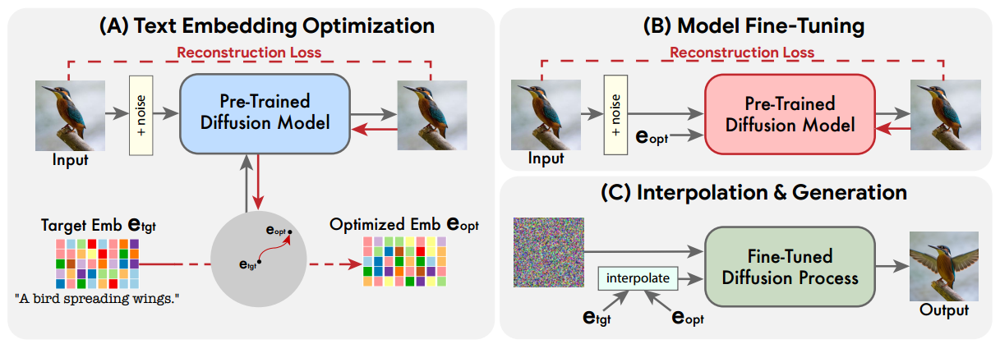
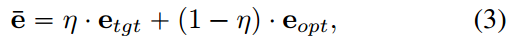
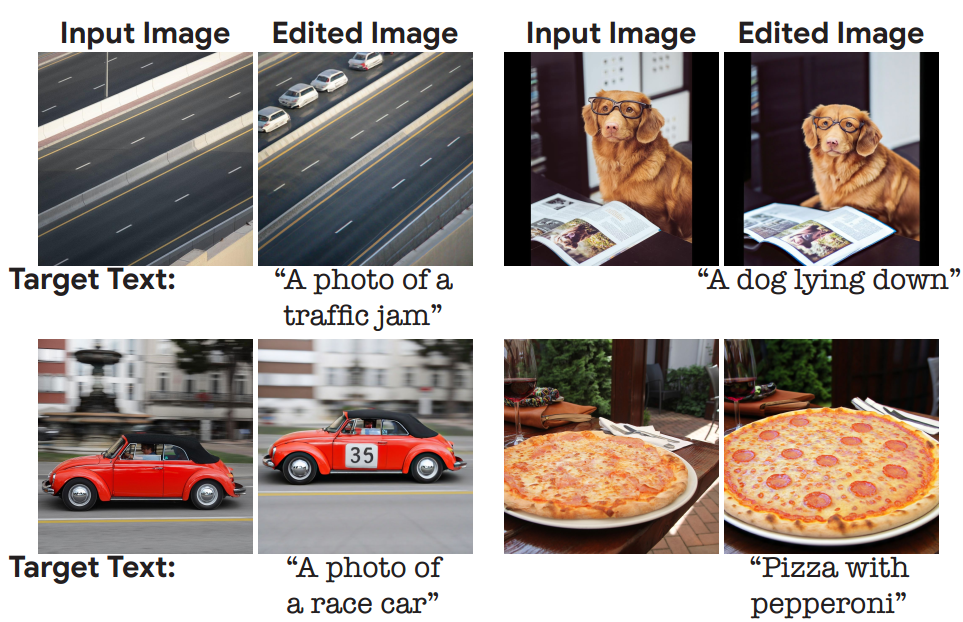

[toc]

> [Imagic: Text-Based Real Image Editing with Diffusion Models](https://arxiv.org/abs/2210.09276)
>
> [unofficial code](https://github.com/sangminkim-99/Imagic)

# 问题提出

- 之前的模型一般<u>*只支持一种编辑*</u> (e.g. 一个模型只能调整位置，另一个模型只能调整颜色)
- 之前的模型一般<u>*只支持相同类型的图像*</u> (e.g 一个模型只能调整人像，另一个模型只能调整动物)
- 一些模型除了输入图像外，它们还<u>*需要辅助输入*</u> (e.g. mask)；此外可能<u>*要多幅图像*</u> (e.g. 多个角度) 或<u>*复杂的描述图像的文本*</u>

# 贡献

- 提出了 Imagic 模型；通过 $e_{opt}$ 作为桥梁，利用插值构建出一个特殊的用于编辑图像的 prompt

# 思路

- 模型主要包含 3 个步骤，

  0. 将描述对图像要做什么编辑的 prompt 记作 $e_{tgt}$，将输入的原始图像记作 $\textbf x$

  1. 冻结 unet (猜测 text encoder 也冻结，和 textual inversion 一样只是训练一个新的 embedding 出来)，**使用 $e_{tgt}$ 作为初始化**，**损失函数使用 $\textbf x$ 和普通的重建损失**

     最终得到 **$e_{opt}$，既与输入图像 $\textbf x$ 尽可能接近，也保留了 $e_{tgt}$ 的语义**

  2. 对 **unet 进行训练**，**输入 prompt 为 $e_{opt}$，损失函数仍然使用 $\textbf x$ 和普通的重建损失**

     > 这一步可以看做是让模型通过 $e_{opt}$ 这个“桥梁”学会 $e_{tgt}$ 的“语言”

  3. 这一步是<u>*推理步骤*</u>，使用插值得到 $\bar e$，

     

     然后**使用 $\bar e$，得到编辑后的图像**

     论文中设置 <u>*$\mu$ 为 0.6 到 0.8*</u>

- 如果对图像有一些**后处理 (e.g. 超分模型)，论文提出使用 $e_{tgt}$ 和 $\textbf x$ 进行训练**

- 该方法在训练过程中<u>*仅使用较少的 step*</u>，如 stable diffusion v1.4 第一阶段使用 1000 steps，第二阶段使用 1500 steps

# Limitation

- Imagic 需要对每一个新的 prompt <u>*重新进行一轮训练*</u>

- 编辑程度过低或不忠实于原图，

  

  可能的解决思路，是更灵活地调整超参数 $\mu$