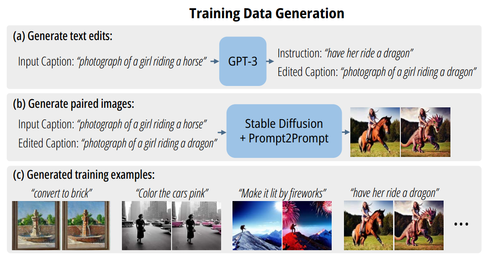
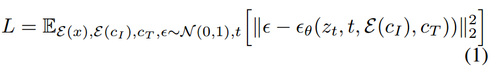
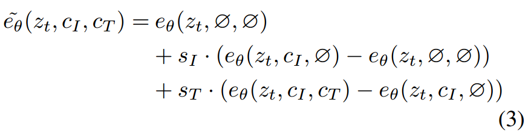

[toc]

> [InstructPix2Pix: Learning to Follow Image Editing Instructions](https://arxiv.org/abs/2211.09800)
>
> [official code](https://github.com/timothybrooks/instruct-pix2pix)

# 问题提出

- 之前的模型对于相似的 prompt 并一定保证给出相似的结果 (考虑到之前的模型很多是“专用”的或是对某个 prompt 单独训练的，这样的情况确实有可能)

# 贡献

- 利用 GPT-3 和 prompt2prompt 生成 `(原始描述, 编辑指令, 编辑后描述)` 及编辑前后的图像对；然后使用 instruction tuning 的方式训练模型

# 思路

- **数据集构建**

  

  数据集的构建目标是一个<u>*三元组*</u>，**`(原始描述, 编辑指令, 编辑后描述)`**

  0. 论文作者首先手动打标了 700 个三元组
  1. 将这些三元组作为数据 <u>*fintune GPT-3*</u>，剩下的数据就可以由 GPT-3 继续；最终越 0.45M 个
  2. 通过 <u>*prompt2prompt*</u> 和 `(原始描述, 编辑后描述)` 来大量生成表示编辑前后的数据对；每个三元组生成 100 张候选图片
  3. 对 100 张候选图片进行筛选；主要利用 <u>*CLIP sim*</u>，
     - 图像-图像相似性 > 0.75
     - 图像-描述相似性 > 0.2
     - 方向相似性 (Directional CLIP Similarity) > 0.2；用于表示 text 和 image 的变化趋势是否一致
  4. 选择过滤后的 top-10 作为最终的训练数据

- **训练过程**

  训练过程中的输入额外包括，<u>*原始图像 $c_I$ ($\mathcal{E}$ 表示 vae encoder)，编辑指令 $c_T$*</u>，

  

  $c_I$ 和 $z_T$ 会在 **channel 维度 concat** 在一起

- **classifier free guidance**

  

  为了让 cfg 能更好地发挥效果，$c_I$ 和 $c_T$ 在<u>*训练过程*</u>中都有 5% 的可能被丢弃

  > uncondition 情况下模型的生成能力过好或过差都是不利于 cfg 的

  $s_T$ 论文设置为 <u>*5-10*</u>，$s_I$ 论文设置为 <u>*1-1.5*</u>

- **训练细节**

  - GPU: 使用了 8 张 40GB NVIDIA A100 显卡
  - 训练时间: 总共训练了 25.5 小时
  - 分辨率: 训练分辨率为 256x256，但模型在推理时可以很好地泛化到 512x512 分辨率
  - 批大小: 总批大小为 1024

  > 该论文中 instruction tuning 的难度和对资源的消耗好像并没有非常庞大

# Limitation

- instruct pix2pix 对空间和数学的生成能力较弱 (可能是 prompt2prompt 在这方面有欠缺从而影响数据集导致的)

  可能的解决方案是引入强化学习