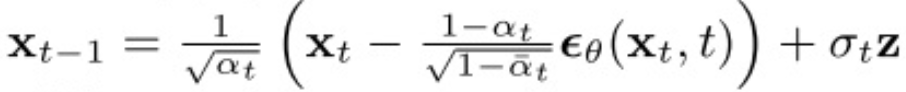
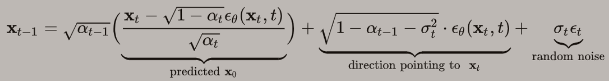
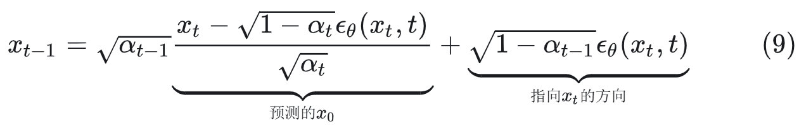
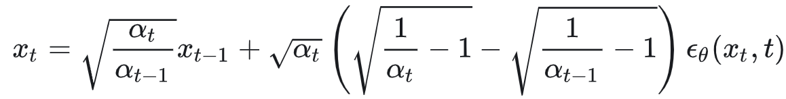
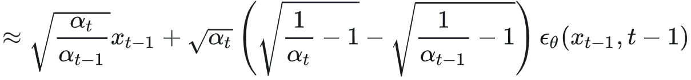
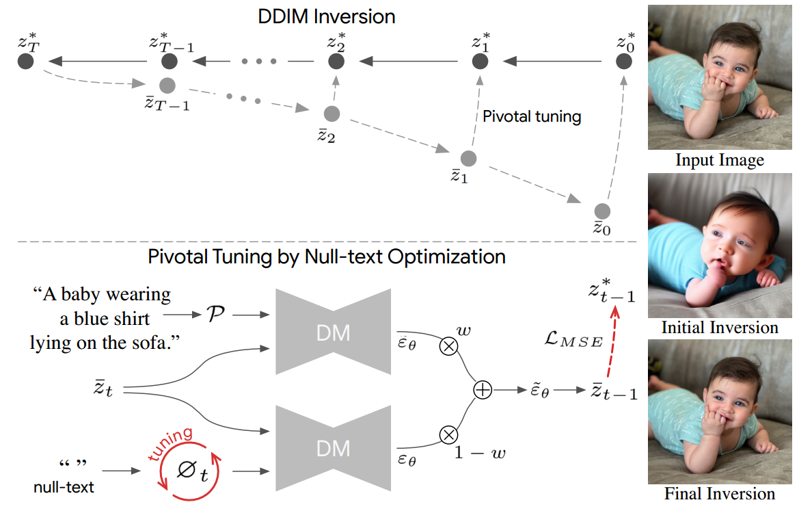
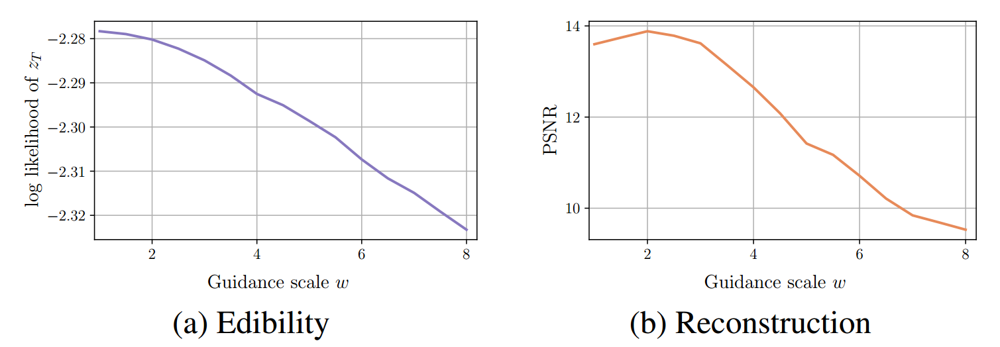
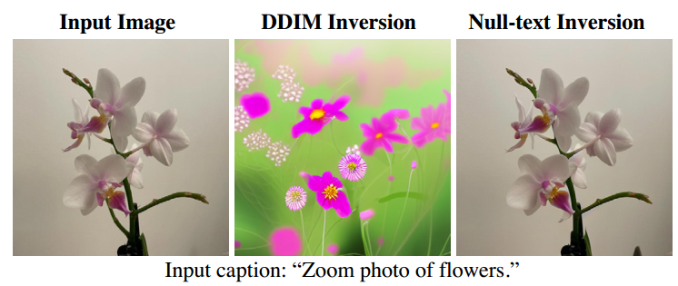
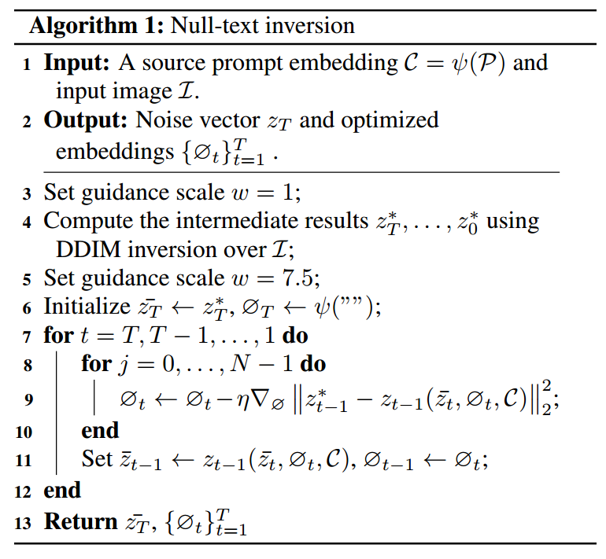

[toc]

> [Null-text Inversion for Editing Real Images using Guided Diffusion Models](https://arxiv.org/abs/2211.09794)
>
> [unofficial code](https://github.com/thepowerfuldeez/null-text-inversion)

# 问题提出

- prompt-to-prompt 之类利用 attn map 的编辑方式很有效，但必须要将原图 $z_0$ 还原回 $z_T$；现有的 inversion 方法在结合 cfg 时还原效果不佳

  > 该论文的核心贡献是一个 inversion 算法，在得到 $z_0$ 到 $z_T$ 的所有“状态“后，使用 prompt-to-prompt 或其他编辑算法都是可行的

# 贡献

- 提出了一种解决 DDIM inversion 过程中，cfg 权重造成误差被放大，导致还原出的 $\hat{z_0}$ 不够精确的问题

# Preliminary

- DDIM 是**确定的**采样方式

  相对 DDPM 来说，在使用 parameterization trick 的过程中，<u>*会引入一个符合标准正态分布的随机项*，</u>

  ，$z \sim N(0,1)$

  而对于 DDIM，则是规定**方差的取值为 0**，

  ，$\sigma_t=0$，$\epsilon_t\sim N(0,1)$

  <u>*随机项被舍去*</u>，因而说 DDIM 采样是确定的

- 由于 DDIM 的确定性，除了从 $x_t\to x_{t-1}$，也可以推导 $x_{t-1}\to x_t$，后一个过程称作 **DDIM inversion**

  根据 ，可以<u>*将 $x_t$ 前的系数和其它项都移到到 $x_{t-1}$ 一侧*</u>，得到，

  

  但是在 inversion 过程中，基于 $x_{t-1}$ 是不可能预测出 $\epsilon_{\theta}(x_t,t)$ 的，所以一般会**使用 $\epsilon_{\theta}(x_{t-1},t-1)$ 替代**

  

  > DDIM inversion 的代码实现，是根据输入的 $x_{t-1}$，得到 $t-1$ 时刻对全部噪声 $\epsilon_{\theta}$ 噪声的预测，然后根据上面的公式得到 $x_t$，以此类推

- 简言之，在 DDIM inversion 中，使用 $t-1$ 时刻预测的噪声替代了 $t$ 时刻预测的噪声，可以看做是<u>*照着 $x_T\to x_0$ 过程中的“答案”构建出的 $\hat {x_T}$*</u>

  > 这和使用公式“一步加噪”是完全不同的，可以理解为“一步加噪“对 $x_T\to x_0$ 的过程是没有任何”交互“的，没有办法保证 DDIM 去噪结果和 $x_0$ 就是一致的

- 使用 $\epsilon_{\theta}(x_{t-1},t-1)$ 作为替代一方面还是比较精准的 ($t$ 和 $t-1$ 作为相邻时间步对噪声的预测不会差的太多)，但同样也**会慢慢积攒误差**，而这个误差<u>*有被放大的可能*</u>

# 思路

**实验发现**

- 在 inversion 过程中进行噪声时，是可以选择是否使用 cfg 的

  根据论文中的实验，

  ，横坐标 $\omega$ 表示 cfg 中的权重

  (a) 表示 inversion 得到最终的 $z_T$ 和标准多元高斯分布的差距，<u>*值越小表示可编辑性越差*</u> (i.e. 越接近标准高斯分布说明模型的“可能性”越多，对 $z_T$ 的还原越好)

  (b) 表示使用 PSNR 对还原出的 $\hat{z_T}$ 和 $z_T$ 之间图像质量的差距

  综上，在 $z_0\to z_T$ 的过程中，**$\omega=1$ 才能够较好地还原出 $z_T$**

  > $\omega$ 较大时可能放大了 DDIM inversion 时积攒的误差
  >
  > 如图可以看到和原图差距还是比较明显的，

- 但是在对图像的<u>*编辑过程中 ($\hat{z_T}\to x^{\prime}_0$)，$\omega=1$ 的效果是很有限的*</u>；但另一方面，inversion 如果是按照 $\omega=1$ 进行的，<u>*去噪过程却搭配 $\omega=7.5$ 又会导致 inversion 失去大部分意义*</u>

  为了解决上述的矛盾，论文提出了 null text inversion

**算法步骤**

0. 如果原图本身没有 prompt，那么 <u>*prompt 可以来自 CLIP、BLIP 之类的模型*</u>，对结果的影响不大

1. **inversion 过程中，依然使用 $\omega=1$ 进行**，以保证还原出可编辑性最好的 $z^*_T$ 和”中间态“ (step 4)

2. **设置 $\omega=7.5$，训练一个 null embedding (记作 $\emptyset_t$)** 来学习如何“处理” $1\ne 7.5$ 造成的误差 (step 5-6)

   这个 $\emptyset_t$，是**针对每个时间步的**，且仅针对 $\omega=7.5$

   > 论文中测试了如果改为全局仅都使用同一个 $\emptyset_t$，效果会变差

3. 默认设置 $N=10$，进入<u>*去噪过程*</u>，**对 null embedding 进行训练**，**gt 是 step 4 进行 inversion 时得到的“中间态”** (step 8-10)

4. 利用 step 8-10 的结果，<u>*更新初始状态*</u> (step 11)

5. 在之后的编辑过程中，选择合适的编辑方式 (e.g. prompt-to-prompt)，<u>*设置 $\omega=7.5$，并且在 cfg 中使用经过训练的 null embedding 替换*</u> CLIP 等编码器的编码结果

# Limitation

- 该论文提出的 limitation 更多聚焦在 prompt-to-prompt 的不足上，null text inversion 本身没有提到很多

# 参考

- [知乎 图像编辑 inversion 的定义和重要方法](https://zhuanlan.zhihu.com/p/692571204)
- [知乎 DDIM inversion 解析](https://zhuanlan.zhihu.com/p/691650716)
- [周弈帆博客 DDIM 解析](https://zhouyifan.net/2023/07/07/20230702-DDIM/)

