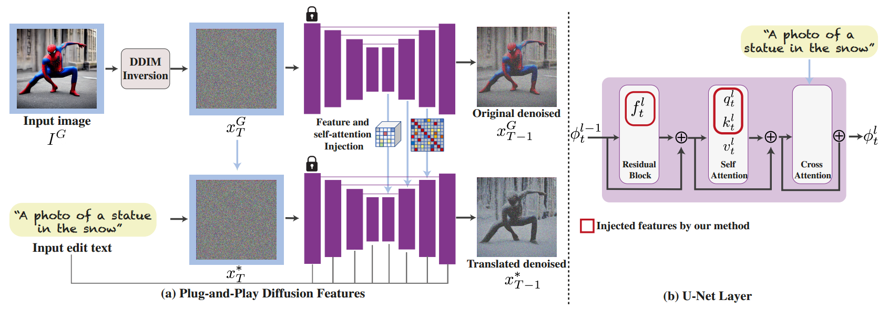

[toc]

> [Plug-and-Play Diffusion Features for Text-Driven Image-to-Image Translation](https://arxiv.org/abs/2211.12572)
>
> [official code](https://github.com/MichalGeyer/plug-and-play)

# 问题提出

- 之前的方法都是需要进行训练的

# 贡献

- 提出了一个利用 feature map 和 self-attn 替换的 <u>*training-free 算法*</u>

# 思路

**实验发现**

- **对于 feature map** (ResBlock **decoder (unet upblock)** 部分)

  

   当 layer = 4 时

  这是对 PCA 可视化的结果；PCA 可以简单理解为对于 channel > 3 的图像，重新压缩回 channel = 3

  论文提出：

  - 在 decoder (unet 的 upblock) 中 **layer = 4 的位置，feature map 更多关注前景和后景的分离**；而<u>*随着 layer 加深，feature map 开始更关注细节*</u>
  - 对于不同的物体，<u>*都包含相同的部位 (e.g. 腿、胳膊) 的语义信息*</u> ( layer=4 在经过 PCA 后主体都为红色)
  - **随着去噪的进行，这些语义信息在一段时间内被维持下去** (主体大致保持红色的状态)

  i.e. 论文认为，可以**利用 layer=4 的 feature map 保存低频信息，保持其在编辑中不受到过大的影响**

- **对于 self-attn (unet upblock) 部分**

   self-attn 的可视化

   橙框标出了最好输出

  论文提出：

  - 在缺少 self-attn 时，模型会<u>*缺少结构上的连续性*</u> (第一行所示)；论文认为**在 upblock 的 layer 4-11 上进行 self-attn 替换最优的**

**完整算法**

在算法的具体实现中，额外引入，

- $\tau_f$ 和 $\tau_A$ 作为 threshold，**仅在去噪的早期进行替换**

  论文中给出了对于采样 step=50，设置 $\tau_A=25,\;\tau_f=40$ 或 $\tau_A=\tau_f=25$

- DDIM inversion 有着确定路径的优势 (可以简单理解为 DDIM inversion 可以从 $z_0$ 返回 $z_T$ 同时保证 $z_T$ 还能去噪回到 $z_0$)，因此**使用 DDIM inversion 路径上的各个“节点”来提供 feature map 和 self-attn**

- **将 negative prompt 加入到 cfg 中**

  > 不过论文同样提出 negative prompt 只有在原图的纹理较为单一时作用较大 (e.g. 原图是一个接近 0-1 mask 的输入)

# Limitation

- pnp diffusion 依赖原图<u>*大体上存在一个主体*</u>，以保证 feature map 是有意义的

   如果是较为精确的 0-1 mask 效果还行，但是如果换成粗糙的、多色的 segmentation mask 效果就不行了