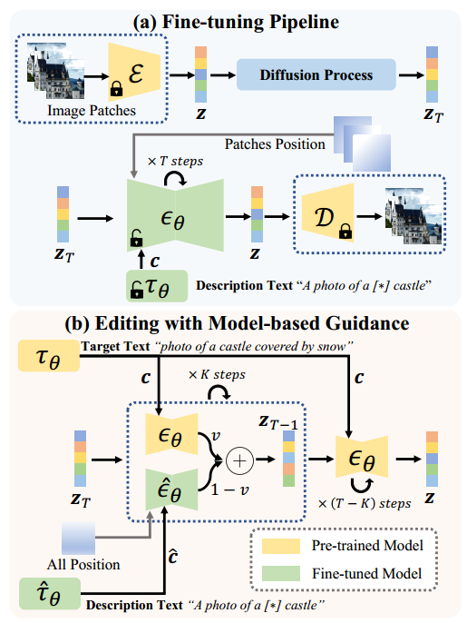
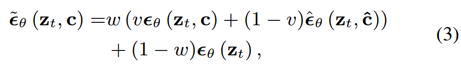
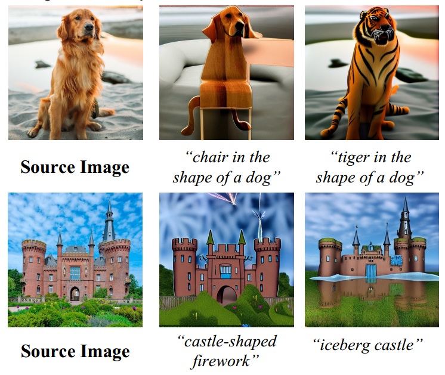

[toc]

> [SINE: SINgle Image Editing with Text-to-Image Diffusion Models](https://arxiv.org/abs/2212.04489)
>
> [official code](https://github.com/zhang-zx/SINE)

# 问题提出

- 在一些极端情况下，数据数量仍会少于 Textual Inversion、DreamBooth 等方法的需求，此时如果仍然使用这种方法可能导致在原图像、caption 上都出现过拟合问题
- 之前的方法在不同分辨率的图像上的生成效果不佳 (e.g. sd v1.5 是在 512*512 上训练的)


# 贡献

- <u>*利用预训练模型和经过 DreamBooth 训练的模型，结合 cfg*</u> 的思路，平衡两者的优势，从而缓解过拟合、编辑性不足的问题
- 对单一图像的编辑很可能出现图像分辨率与预训练模型的分辨率不匹配问题，通过引入<u>*随机剪裁+位置编码*</u>缓解


# Preliminary

- 如 sd v1.5 的模型理论上<u>*是可以生成其它一些分辨率*</u> (e.g. 640×960、768×512、384×896) 的图像的，只是训练集都是 512*512，所以在其它一些分辨率上的图像质量得不到保证

  为了生成其它分辨率，不一定需要对模型的结构进行大改 (e.g. 通道数、卷积核大小等)


# 思路



**Model-Based Classifier-Free Guidance** (图 b)

- 论文默认设置 $v=0.7$，$\epsilon_{\theta}$ 是预训练模型，对应使用 $c$ (Target Text)；$\hat{\epsilon_{\theta}}$ 是经过 DreamBooth 训练的模型，对应使用 $\hat c$ (Description Text)。**线性结合**在一起，

  

  该**修改后的 cfg 算法默认进行 $K=400$ 次，而之后改为只使用预训练模型和普通的 cfg**

**Patch-Based Fine-Tuning**

- 在进行 DreamBooth 训练过程中，论文提出对原图**随机裁剪不同的 patch**，然后**恢复到预训练模型的分辨率 (e.g. 512*512) 进行噪声预测和损失函数计算**

  训练中额外提供与裁剪位置对应的**位置编码**，而在推理过程中则使用整张图的位置编码

  > 在具体的代码实现中，
  >
  > 1. 先根据原图的大小，生成整张图的位置编码
  >
  >    这里的 init_size 应该是指原图的大小
  >
  > ```python
  > head_grid = self.head_position_encode(torch.ones([x.shape[0], x.shape[1], self.init_size, 	self.init_size], dtype=self.dtype, device=x.device)) # (B,C,init_H,init_W)
  > ```
  >
  > 2. 从整张图的位置编码中 crop 出被裁剪区域的位置编码，然后再通过插值还原回预训练模型的分辨率
  >
  > ```python
  > head_grid = torch.cat([F.interpolate(hg.unsqueeze(0)[:, :, box[0]: box[2], box[1]: box[3]], (x.shape[2], x.shape[3]), mode='bilinear', align_corners=True) for hg, box in zip(head_grid, crop_boxes)], dim=0) # (B,C,x_H,x_W)
  > ```
  >
  > 3. 调整好分辨率后相加融合
  >
  > ```python
  > for i, module in enumerate(self.input_blocks):
  >     ...
  >     if i == 0: # 位置编码引入一次即可
  >         h += head_grid
  >     ...
  > ```


# Limitation

- 当编辑使用的语义变化过大时，编辑效果不佳

  

  可能是 CLIPEncoder 的能力有限，或对于 $v$ 等超参的设置不佳，导致还是发生了过拟合