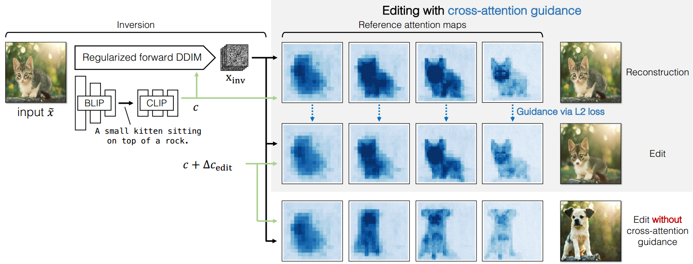

[toc]

> [Zero-shot Image-to-Image Translation](https://arxiv.org/abs/2302.03027)
>
> [official code](https://github.com/pix2pixzero/pix2pix-zero)

# 问题提出

- 一般的编辑方法，除了需要提供原图外，还需要提供对原图的 caption，这个 caption 能表达要编辑的内容，但<u>*较难表达需要保留的内容*</u>
- 之前的方法对原图的忠实度仍然不足

# 贡献

- 优化 DDIM inversion，使得还原出的 $z_T$ 更接近多元标准高斯分布、可编辑性更强

- 利用 cross attn map，优化预测出的噪声 $\epsilon_{\theta}$

-  通过 Conditional GAN distillation 加速推理

  > 这部分暂时略过

# 思路

> 这是一个 training-free 算法

**优化 DDIM inversion 过程**

- 在原始的 inversion 过程中，需要通过预测 $\epsilon_{\theta}(t-1)$ 来还原 $z_t$，对于预测出的噪声，使用额外的损失函数进行优化

- 论文提出损失函数的主要思路，是保证还原出的 $z_T$ 尽可能<u>*接近标准多元高斯分布、具有更多的可编辑性*</u>

  - 这个需求也可以转化为，$x$ 和 $y$ 表示二维<u>*横纵坐标*</u>，$L_{pair}$ 简言之衡量 $(x,y)$ 处的噪声和 $(x-\delta,y)$ 处和 $(x,y-\delta)$ 处之间的**相关性**，**值越低表示越不相关**

    

    像素之间的噪声越不相关，就可以认为具有更多的可编辑性

  - 此外，引入一个 **KL loss 和多元高斯分布进行比较**，得到最终的损失函数，

    

  > 虽然论文中没有提到如何使用损失函数进行更新，但很可能直接使用梯度更新了预测出的噪声，

**Edit Directions**

- 该论文提出了一种比直接修改 caption (e.g. a cat -> a dog) 更有效的修改 caption 的方式，

  

  利用 LLM 生成包含编辑前后对象的多个 prompt，然后使用 CLIP 得到两者的在 **clip embedding 上的差距**

- 然后将这个 clip embedding 上的差距**直接应用到 source caption 上**，，以得到 target caption；用户也不需要提供额外的 target caption 了

**Editing via Cross-Attention Guidance**

1. 通过优化后的 DDIM inversion 收集各个“中间态”和其对应的 cross attn map
2. 改为使用 $c_{edit}$，在每一步去噪过程中，**额外使用  ($M$ 表示 cross attn map) 来优化预测出的噪声 $\hat\epsilon$**

# Limitation

- 当原始图像的构图过于“罕见” (左图)，或对精细度要求较高时 (右图尾巴部分；pix2pix zero 使用 sd v1.4) 效果较差

  

  精度不足可能是 sd 本身能力的局限导致