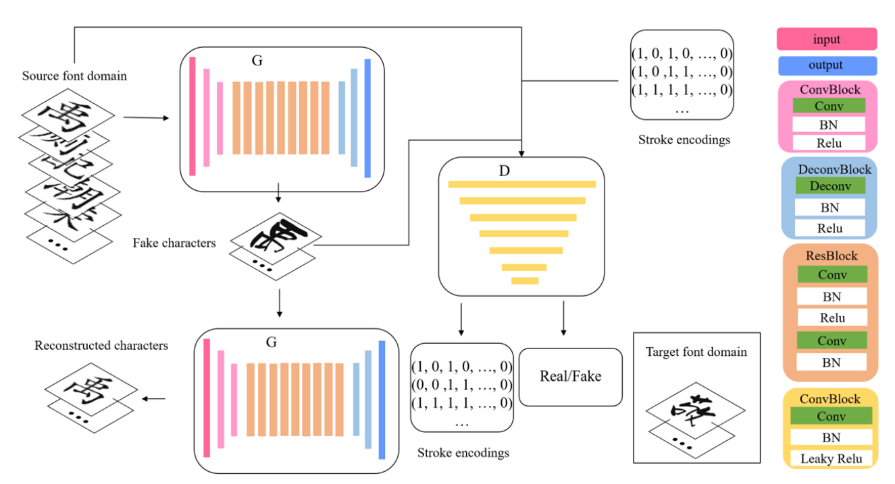
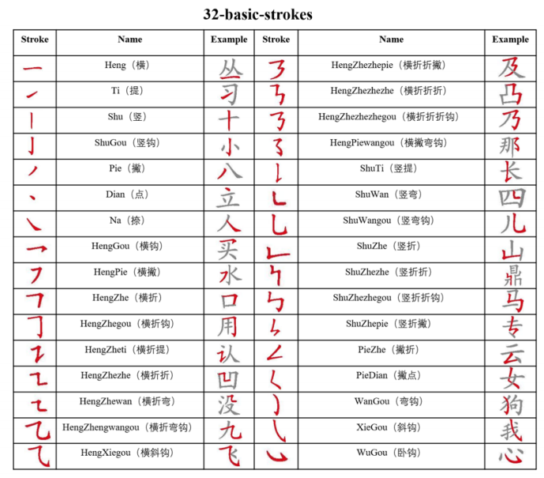
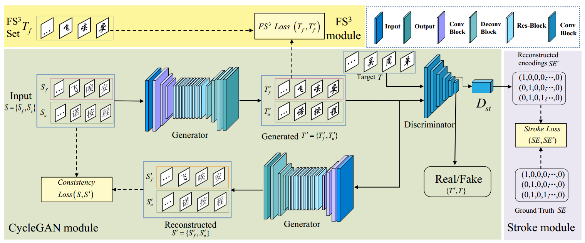
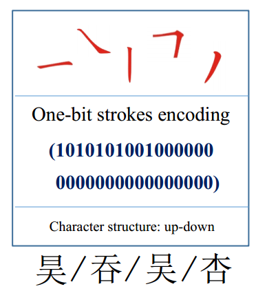

[toc]

# StrokeGAN

> [StrokeGAN: Reducing Mode Collapse in Chinese Font Generation via Stroke Encoding](https://arxiv.org/abs/2012.08687)
>
> [源码](https://github.com/JinshanZeng/StrokeGAN)
>
> AAAI 2021

## 贡献

- 在 CycleGAN 的基础上，添加了一个 <u>*stroke encoding*</u> (32 种 stroke，转为 32 维的向量)

  > CycleGAN 的核心思想是将 A -> B 进行转换外，还进行 B -> A 的风格转换，这样某个对象不需要在 A 和 B 风格上都有 gt (A -> B -> A* 只需要监督 A* 和 A 的差距，B -> A -> B 同理)
  >
  > 一般地，新的风格转换会需要训练新的 CycleGAN

- 损失函数中增加<u>*对 stroke 的监督*</u>

## 思路

### Framework

**stroke encoding**

- <u>*32 种 stroke*</u>，转为 <u>*32 维*</u>的向量 (1 表示该文字存在这个 stroke)

  > 这种编码方式并不考虑 stroke 出现的次数

  

**损失函数**

- 对抗损失
- 循环一致性损失 (i.e. A* 和 A 之间的损失)
- <u>*Stroke-encoding reconstruction loss*</u>：对生成图像重新提取 32 维的 stroke encoding 计算 loss

### 数据集

> [数据集地址](https://github.com/JinshanZeng/Stroke_Based_Chinese_Character_Generation_Dataset)

- 为不同 font 的文字收集了 stroke encoding

> 但是理论上应该只要对随便一种 font 收集 stroke encoding 就可以了吧，毕竟 stroke encoding 应该和 font 无关吧

## Evaluation Metric

- 内容准确率 (Content Accuracy)

  > 原文：Specifically, a pre-trained HCCG-GoogLeNet was exploited to calculate the content accuracy.
  >
  > 可能类似 LPIPS？

- 识别准确率 (Recognition Accuracy)：人工判断字写的对不对

- 笔画误差 (Stroke Error)：应该是从 stroke encoding 上评价

## Ablation

- stroke encoding 是有效果的 (e.g. 生成的字不容易缺笔画，长得像的字也不容易混淆)

# StrokeGAN+

> [StrokeGAN+: Few-Shot Semi-Supervised Chinese Font Generation with Stroke Encoding](https://arxiv.org/abs/2211.06198)

## 贡献

- 额外考虑了一些<u>*容易混淆的字的监督*</u>，对这些字<u>*使用 pixel-level loss*</u>

## 思路

### Framework

**$FS^3$ module**

- 有<u>*一些字符的 stroke encoding 是一致的*</u>

  

  对于这些字符就使用额外的 pixel-level 的 loss 进行<u>*更强的监督*</u>

### 数据集

- 14 个 font，每个 font 大约 3000 个字符

## Evaluation Metric

- FID
- LPIPS
- PSNR
- SSIM

## Ablation

- 更强的监督有效