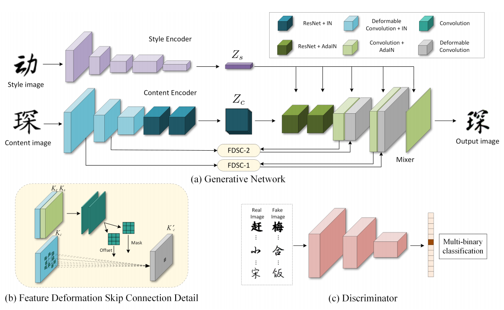
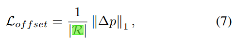
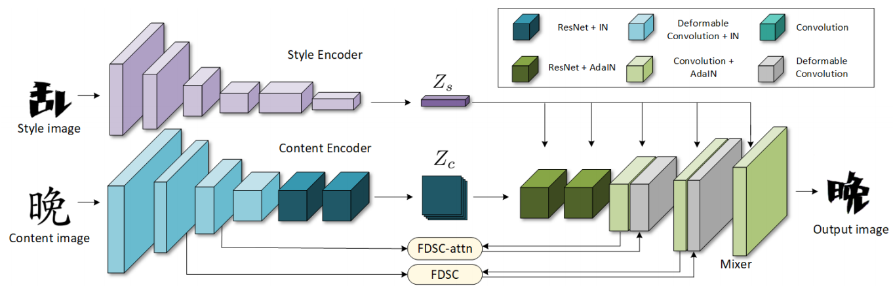
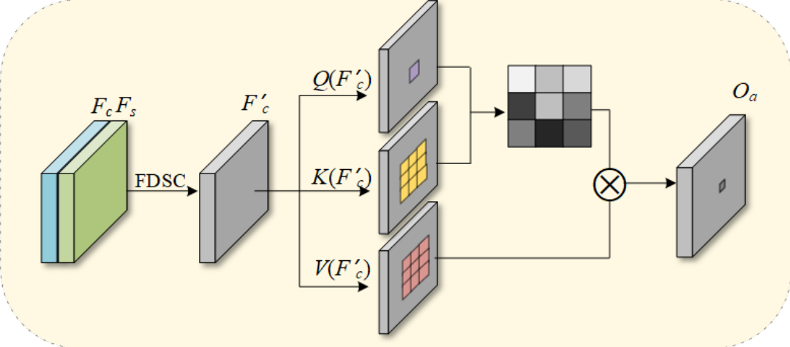
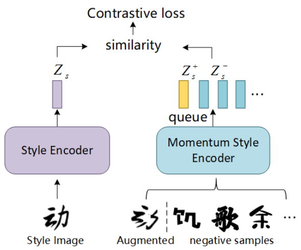

[toc]

>[DG-Font: Deformable Generative Networks for Unsupervised Font Generation](https://arxiv.org/abs/2104.03064)
>
>[源码](https://github.com/ecnuycxie/DG-Font)
>
>CVPR 2021

# DG-Font

## 思路

- 将一部分卷积网络<u>*替换为可变形卷积*</u>；此外，使用<u>*可变形卷积 deformable convolution network 在 skip connect 中对 encoder 部分的输出*</u>进行操作 (这种做法可能有助于向 decoder 中<u>*产生了一定变形*</u>的生成图像更好地提供信息)
- 在损失函数中对<u>*可变形卷积的位移*</u>进行监督

## 贡献

### Framework

**Feature Deformation Skip Connection**

- <u>*卷积的位移*</u>通过 $K_c$ (i.e. content image 的 feature map) 和 $K_s$ (i.e. 是已经注入 style feature $Z_s$ 生成过一次的 feature map) 通过一系列卷积网络计算得到

  > 原文： a feature map Kc extracted from the content image and a style guidance map Ks. Ks is extracted from the mixer after injecting the style code Zs.
  >
  > 所以理论上是 decoder 的输出和 encoder 的输出一起决定了位移，不知道为什么要这么设计

- 论文中认为<u>*在前几层使用可变形卷积*</u>是更有效的

**损失函数：**

- 对抗损失

  > 论文中提出了一个 multi-task discriminator，但没有看懂

- 将生成的图像重新提取 content feature，然后和 gt 的 content feature 计算损失

- 将 <u>*content image 同时提取 content feature 和 style feature*</u> (i.e. 自己生成自己)，然后生成图像和 content image 计算损失

- $L_{offset}$：限制 DCN 的位置偏移幅度不能太大

  $R$ 表示可变形卷积的层数

  

  > 可能因为不希望关注到不同的 stroke 上吧

### 数据集

> [字体库地址](https://www.foundertype.com/index.php/FindFont/index)

- 从开源的字体库获取字体，然后通过<u>*字体生成数据集*</u>

  训练时使用 400 种字体，每个生成 800 个字符

## Evaluation Metric

- 在训练集中出现的 font 和没有出现的 font 上分别测试

  > font 在训练集中出现但可能字符是没出现过的？

-  L1 loss 

- RMSE 

- SSIM 

- LPIPS 

- FID

## Ablation

- 将一部分网络替换为可变形卷积是有效的
- FDSC，以及两层 FDSC 的设计是有效的
- 对卷积位移进行限制是有效的

# DG-Font++

## 贡献

- 提出了 attn 形式的 <u>*FDSC-attn*</u>，<u>*以 feature map 的形式通过 self attn 实现*</u>
- 使用<u>*对比损失对 style 进行监督*</u>

## 思路

### Framework

**FDSC-attn**

- <u>*feature map 形式的 self-attn*</u>

**损失函数**

- 使用对比学习来更好的监督 style loss

  

  <u>*正样本来自对 gt 的随机缩放、旋转、平移等*</u>，<u>*负样本来自其它字符*</u>

