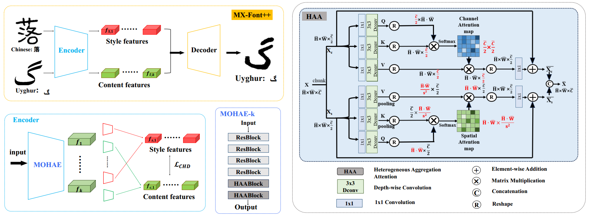

[toc]

# MX-Font

> [Multiple Heads are Better than One: Few-shot Font Generation with Multiple Localized Experts](https://arxiv.org/abs/2104.00887)
>
> [源码](https://github.com/clovaai/mxfont)
>
> ICCV 2021

## 贡献

- 使用<u>*多 expert、多 head*</u> 的方式，让模型学习<u>*关注文字的不同部分*</u>；然后通过 <u>*content feature 和 style feature 的提取与解耦*</u>生成图像
- 针对<u>*多 expert 设计新的损失函数*</u>；设计新的<u>*损失函数以更好地解耦*</u>

## 思路

### Framework

- 每个 <u>*expert 与解耦的网络*</u>基本都是卷积 + 激活 + 归一化
- 直觉上，每个 expert 关注字符的不同部位 (e.g. 关注左半部分、右半部分)；但并没有使用显式的监督

**损失函数：**

- $L^G_{adv}$：一般的对抗损失函数

- $L_{recon}$：像素级别的 $L_1$ 损失函数

- $L_{fm}$：feature map 级别的损失函数

- $L_{s,i}$：对于解耦的后的 style feature 和 content feature 都要<u>*分别通过 style classifier (i.e. $Cls_s$) 和 content classifier (i.e. $Cls_u$)*</u>

  以 style feature 为例，通过 $Cls_s$ 能够分类准确的同时，经过 $Cls_u$ 接近均匀分布 (i.e. 解耦足够彻底，不包含任何 content 信息，以至于 content classifier 完全无法分辨)

  

- $L_{c,i}$：对于 style 来说，每个图像都只对应一个 gt style，但是论文中则使用 component-level 的监督，i.e. <u>*content 则可能对应多个 component*</u>

  简言之，每个 expert “术业有专攻”，对于“不擅长”的 component <u>*如果分类错误了不应该也计入损失函数*</u>；为每个 expert “分配”一部分 component 计算 CE loss，而“分配“的原则是希望最终的<u>*置信度的和最大*</u>

  

- $L_{indp\;exp,i}$：<u>*HSIC 算法*</u>可以评价数据间的独立性；<u>*不同 expert 提取出的解耦前的 feature map 间的独立性*</u>希望尽可能强 (i.e. 每个 expert 关注文字的不同部分)

- $L_{indp,i}$：同样使用 <u>*HSIC 算法*</u>；<u>*style feature 和 content feature 间的独立性*</u>希望尽可能强 (i.e. 尽量解耦)

### 数据集

- 和 LF-Font 使用相同的数据集

## Evaluation Metric

- Acc (style 正确、content 正确、两者都正确)
- LPIPS
- FID

## Ablation

- 多 expert 是有效的

  每个 expert 确实都在关注文字的不同部分 (即使没有显式监督)

- style classifier 和 content classifier (component-level) 分别进行监督是有效的
- 损失函数设计有效

# MX-Font++

> [MX-Font++: Mixture of Heterogeneous Aggregation Experts for Few-shot Font Generation](https://arxiv.org/abs/2503.02799)

## 贡献

- 对 expert 模块进行了提升，提出了一个<u>*从 channel 和 spatial 两个方向提取 feature*</u> 的网络
- 增加新的<u>*损失函数监督 style 和 content feature 的解耦*</u>

## 思路

### Framework

**Mixture of Heterogeneous Aggregation Experts (MOHAE) 和 Heterogeneous Aggregation Attention (HAA)**

- 论文中从 **channel 和 spatial** 两个方向计算 attn

  channel 使用 **channel attention** 实现；spatial attention 对 K、V 进行 **pooling** 实现

  > 感觉像是拆分了 CBAM

**将 content 和 style feature 解耦**

- 对生成图像的 <u>*component id 计算 CE loss*</u>

- **Content-Style Homogeneity Loss**

  

  整个函数的最小值是 0，当且仅当 $f_s$ 和 $f_c$ **方向相反**时
  
  > 但是方向相反就代表两者的解耦充分吗？

> 看起来 MX-Font 和 MX-Font++ 对解耦的监督都不是直接通过 gt 实现的，损失函数监督的都是间接的值

### 数据集

-  400 个 fonts，每个 font 3346 characters

## Evaluation Metric

- 在 UFSC 和 UFUC 上分别测试

## Ablation

- Lcsh 和 HAE 有效
