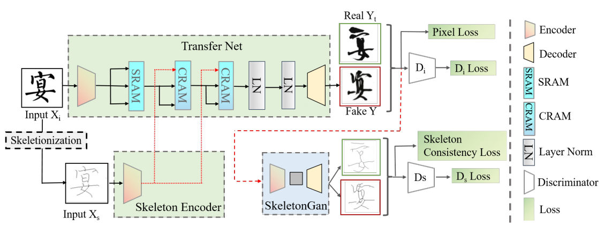
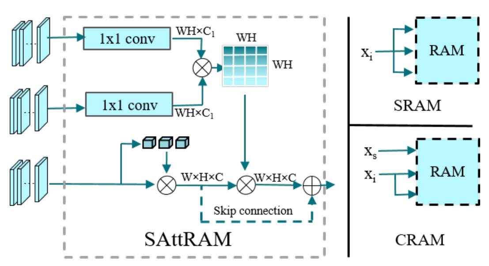
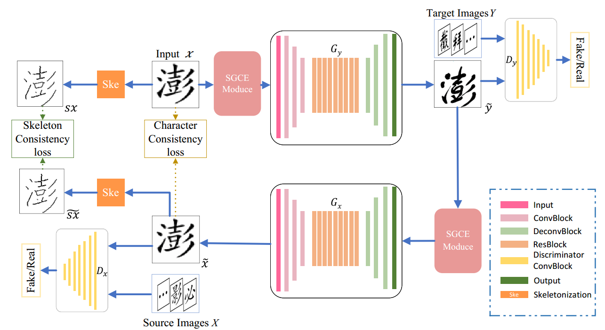
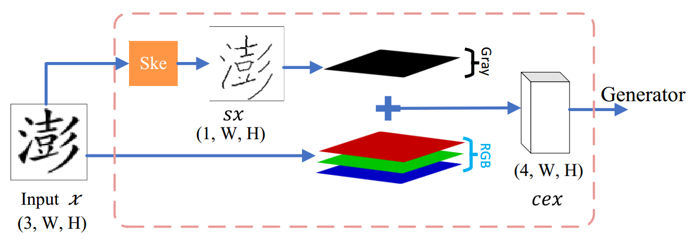

[toc]

# SE-GAN

>[SE-GAN: Skeleton Enhanced GAN-based Model for Brush Handwriting Font Generation](https://arxiv.org/abs/2204.10484)
>
>ICME 2022

## 贡献

- 提出通过抽取 <u>*skeleton 来辅助了解 content 信息*</u>
- 通过 <u>*class activation map (CAM) 扩展为一个 feature map*</u>，然后进行 <u>*feature map 形式的 cross attn 和 self attn*</u>
- 新的损失函数对 <u>*skeleton 进行监督*</u>

## 思路

### Framework

> 这个结构图好像没有画出 style image 或 style feature 是如何注入的
>
> 后面损失函数中使用过了循环一致性损失，所以很可能是使用了 CycleGAN 结构，只需要收集数据集就可以学习 style，每个 style 都是要重新训练的

**Skeletonization：**

- 来自 《A Fast Parallel Algorithm for Thinning Digital Patterns》的算法 (i.e. <u>*Zhang-Suen 算法*</u>)，通过对二值字符图片迭代进行腐蚀和膨胀，简单有效地抽取出skeleton

**SAttRAM：**

- class activation map (CAM)：通过全局池化将每个 feature map 提取为一个数值 (i.e. k 个 channel 的 feature map 就提取一个 k 维的 embedding)

  > CAM 可以用来查看每个不同的类卷积网络关注的是哪些部分
  >
  > 论文里面提到了这个概念，但是感觉后面没有用到这个概念，可能还是用来对比的？

- 简言之，这个模块用 <u>*feature map 的形式实现了类似 attn 的操作*</u>

**损失函数：**

- 与 gt 的 pixel level 损失
- 与 gt 的 skeleton 损失
- 循环一致性损失
- 对抗损失

### 数据集

> 方正字库

- 6 中 font，共 15,000 张 image

## Evaluation Metric

- content acc：使用 OCR 实现
- FID

## Ablation

- skeleton 的加入和监督是有效的
- SAttRAM 结构是有效的

# SGCE-Font

> [SGCE-Font: Skeleton Guided Channel Expansion for Chinese Font Generation](https://arxiv.org/abs/2211.14475)

## 贡献

- 将 <u>*skeleton 在通道上 concat 到图像*</u>中，以更好地提供 content 信息

  > SGCE-Font 用的也是 CycleGAN 结构

  

## 思路

### Framework

**SGCE Module**

- 同样使用 <u>*Zhang-Suen 算法*</u> 提取 skeleton
- <u>*在 channel 上 concat*</u>