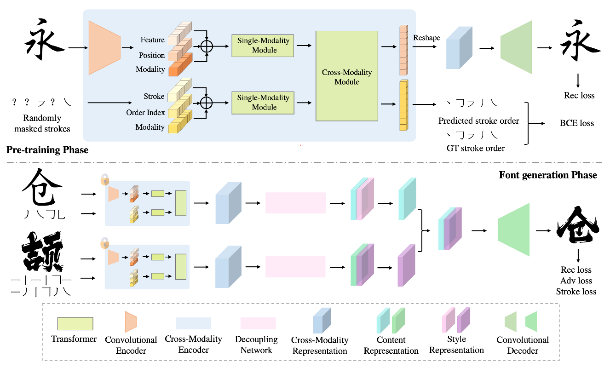

[toc]

> [XMP-Font: Self-Supervised Cross-Modality Pre-training for Few-Shot Font Generation](https://arxiv.org/abs/2204.05084)
>
> CVPR 2022

# 贡献

- 提出了一个<u>*跨模态模块 Cross-Modality Module*</u>，通过 <u>*attention 融合 stroke-level 和 character-level 的 visual embedding*</u>
- 在第一阶段对跨模态模块进行<u>*预训练*</u>，第二阶段中<u>*冻结跨模态模块*</u>，利用提取出的跨模态 embedding 通过 style 和 content 的解耦生成图像

# 思路

## Framework

### 第一阶段：提取跨模态 embedding

**Single-Modality Embedding：**

- embedding 的 `max_seq_len` 为 28 (i.e. 一个字符最多由 28 个 stroke 组成)

- character-level：提取 <u>*visual feature embedding，位置编码，模态信息*</u> (二元，表示是 character-level 还是 stroke-level)，三者 embedding <u>*相加融合*</u>

  > 原文： Similarly, the position embedding and the modality type embedding of each spatial coordinate are mapped from the x-y coordinate and the modality label respectively with separate embedding sub-layers.
  >
  > 位置编码的输入应该是这里的 `x-y`，但没有看懂是什么意思，理论上需要将 (x, y) 的二维信息变成 embedding 某个维度的一维信息

- stroke-level：<u>*stroke id，位置编码 (0 到 29)，模态信息*</u> (二元，表示是 character-level 还是 stroke-level)，三者<u>*相加融合*</u>

  > 原文：Similarly, the position index (from 0 to 29) of a stroke
  >
  > 明明是最多 28 个 stroke，但为什么这里使用了 30 个 index？

**Cross-Modality Module：**

- 简言之，一系列的 self attn + cross attn

**损失函数：**

- 跨模态融合后的 character-level embedding <u>*还原回 character*</u> 和 gt 计算损失函数
- 跨模态融合后的 stroke-level embedding <u>*还原回 stroke*</u> 和 gt 计算 CE loss

### 第二阶段：生成图像

- 将第一阶段的模型<u>*冻结*</u>

## 数据集

> 方正字体库

- 使用开源字体库人造数据；100 种 font，每个 font 7000 character

# Evaluation Metric

- FID
- PSNR
- SSIM
- L1 损失

# Ablation

- 二阶段模型，以及对第一阶段进行预训练的设置有效
- stroke loss 有效