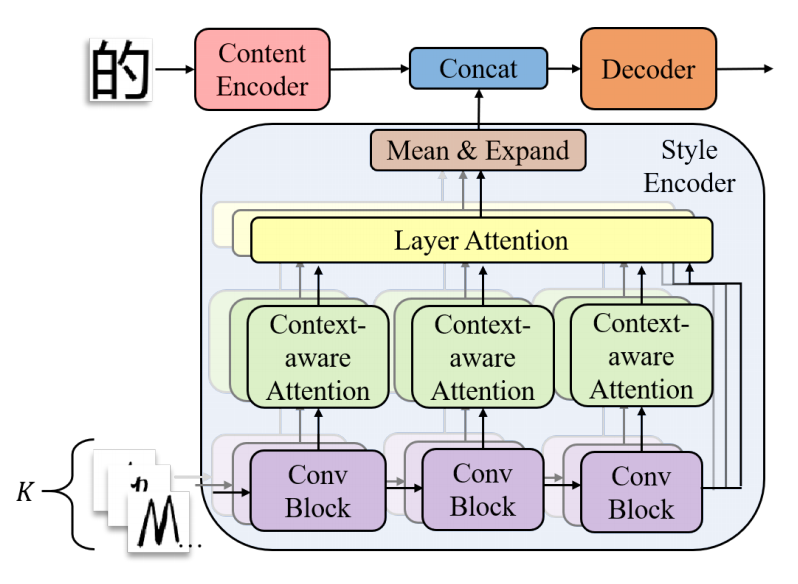
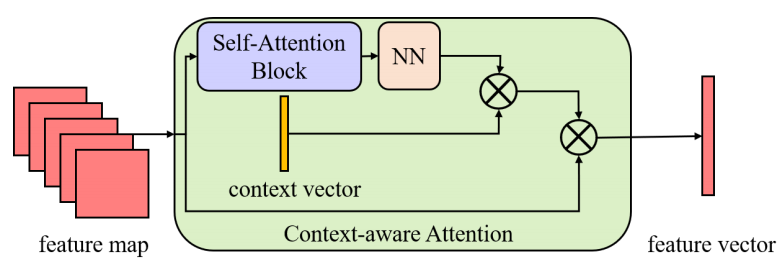
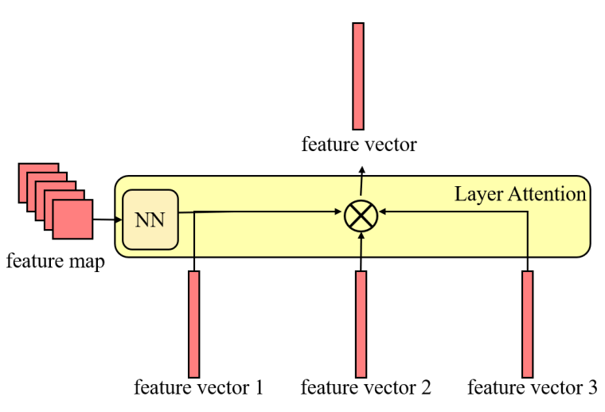
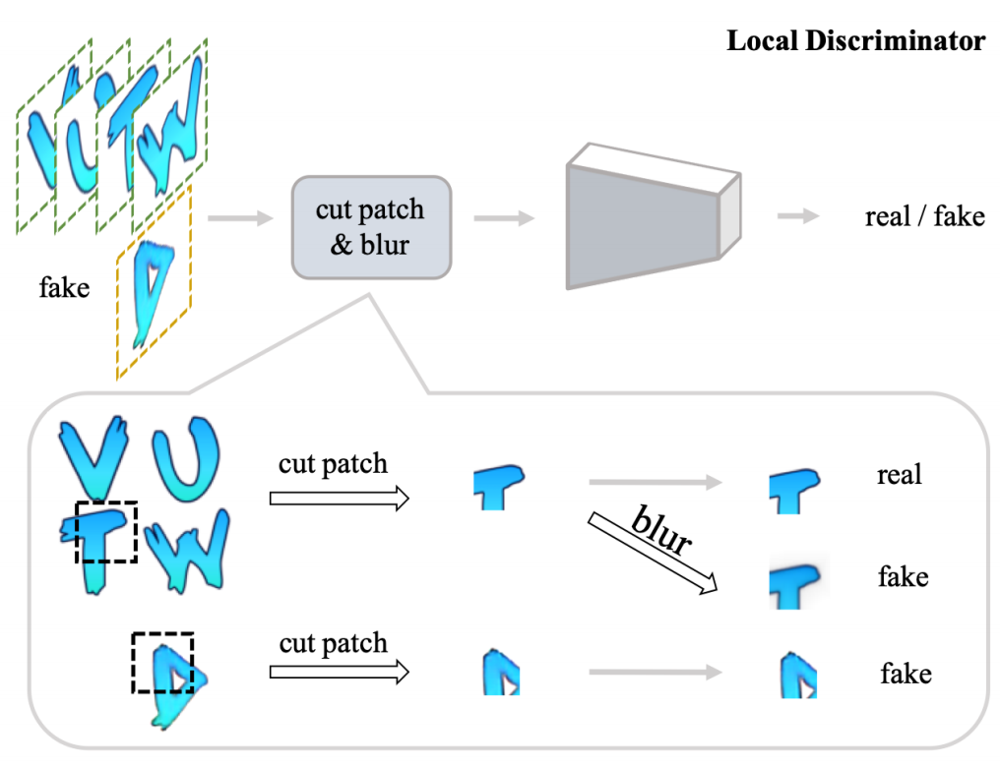

[toc]

> [Artistic Glyph Image Synthesis via One-Stage Few-Shot Learning](https://arxiv.org/abs/1910.04987)
>
> [Few-shot Font Style Transfer between Different Languages](https://openaccess.thecvf.com/content/WACV2021/papers/Li_Few-Shot_Font_Style_Transfer_Between_Different_Languages_WACV_2021_paper.pdf)
>
> [GAS-NeXt: Few-Shot Cross-Lingual Font Generator](https://arxiv.org/abs/2212.02886)

# 贡献

- 使用 `13×13, 21×21, 37×37` 使用<u>*不同的卷积核提取 feature map*</u>，然后通过 <u>*attn 机制融合*</u> (FTransGAN 提出)
- <u>*以 patch 为单位进行损失函数计算*</u>，增加数据量；为 <u>*patch 增加高斯模糊作为负样本*</u>，监督模型生成噪声更少的图像 (AGIS-Net 提出)
- GAS-NeXt 融合了上述两篇论文的优点

# 思路

## Framework

- 上图中的 3 个 Conv Block 表示 <u>*3 个不同大小的卷积核*</u>

**Context-aware Attention**

- 简言之，将 feature map 转为 embedding 后进行 self attn

**Layer Attention**

- <u>*通过 feature map 计算权重*</u>，将三个 feature vector 进行<u>*加权相加*</u>

**损失函数**

- **Local texture refinement loss**：

  

  <u>*以 patch 为单位进行损失函数计算*</u>，从而<u>*增加数据量*</u> (将同一张图的其它 patch 作为负样本)

  为 <u>*patch 增加高斯模糊作为负样本*</u>，监督模型生成噪声更少的图像

# Evaluation Metric

- FID
- SSIM
- pix-Acc

