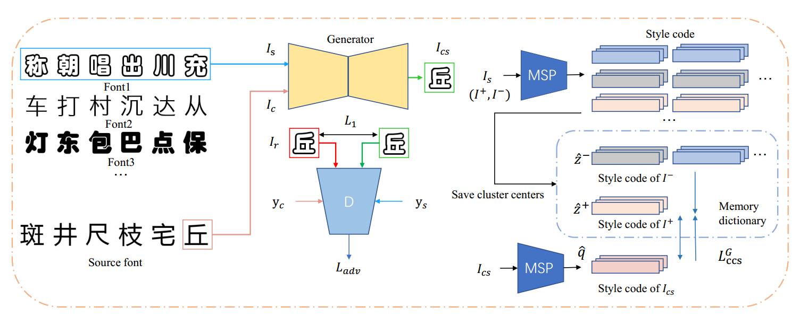
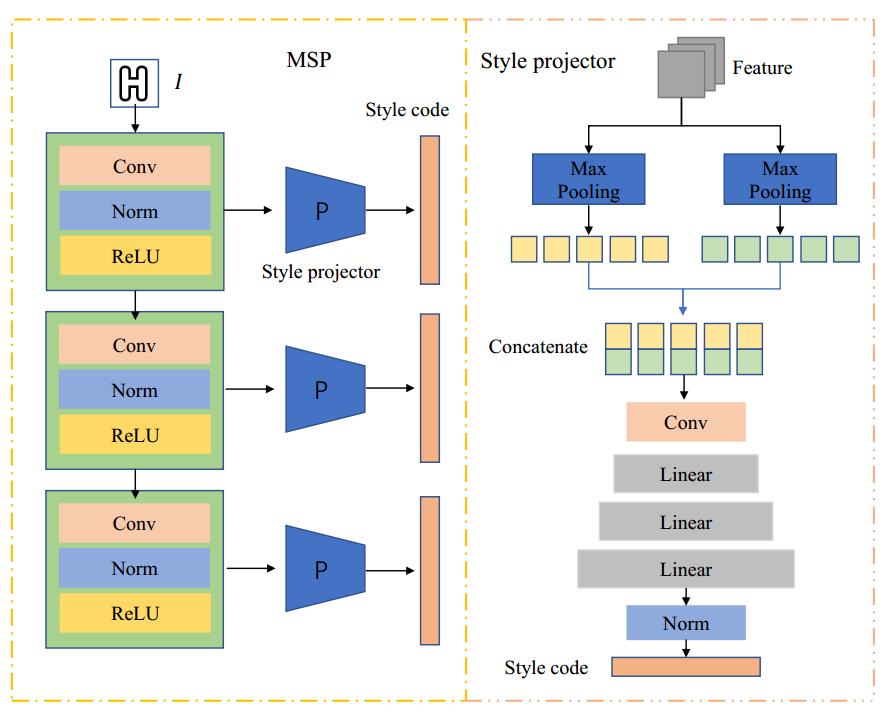

[toc]

> [Few-shot Font Generation by Learning Style Difference and Similarity](https://arxiv.org/abs/2301.10008)
>
> IEEE 2024

# 问题提出

- 之前的工作只关注了 style 和 glyph 之间的解耦；但是对于相同 style 的不同 glyph 应该接近的监督是不足的，可能导致 style 的不统一

# 贡献

- 沿用 FTransGAN 的思路，使用<u>*不同大小的卷积核提取*</u>不同层次的信息；提出通过<u>*平均池化和最大池化提取不同层次 feature 后 concat*</u> (也可以看做不同层次的信息)
- 沿用 AGIS-Net 中 <u>*patch discriminator*</u> 的思路，在 real/fake 判别的基础上对<u>*每个 patch 增加 classifier 监督*</u>
- 提出基于<u>*聚类的对比学习监督 style encoder*</u> 的学习

# 思路

## Framework

**Multi-layer Style Projector (MSP)**

- 使用不同的卷积核<u>*提取到 feature map 为原图分辨率的  1, 1/2, 和 1/4*</u>，作为 MSP 的输入

- 分别通过 <u>*max pooling 和 avg pooling，concat 在一起*</u>作为 feature 处理

  > 图中画了两个 Max Pooling，可能是画错了

**Multi-task Patch Discriminator**

- <u>*每个 patch 增加 classifier 监督*</u>

**Generator**

- 生成器使用了 FTransGAN 中提出的<u>*在 style encoder 中对 style embedding 做 self attn*</u> 的结构

**损失函数**

- **Cluster-level Contrastive Style Loss**，使用对比损失训练 style encoder，特别地，<u>*正样本*</u>来自于数据集中<u>*同一个 font 的 style embedding 的聚类质心*</u>
- 对抗损失
- pixel-level 的 $l_1$ loss

## 数据集

> [数据集地址](https://drive.google.com/file/d/1XJppxR00pyk5xG-64Ia_BF12XSxeZgfa/view)

- 使用 FTransGAN 提出的数据集；847 个 font，每个 font 1000 个字符

# Evaluation Metric

- L1 loss
- LPIPS
- RMSE
- content-acc，style-acc
- content-FID，style-FID

# Ablation

- 增加监督的 Multi-task Patch Discriminator 有效
- Cluster-level contrastive style loss 设计有效