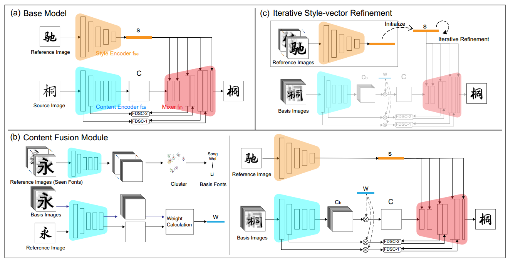

[toc]

> [CF-Font: Content Fusion for Few-shot Font Generation](https://arxiv.org/abs/2303.14017)
>
> [源码](https://github.com/wangchi95/CF-Font)
>
> CVPR 2023

# 问题提出

- 之前的工作选择一个固定的 font 来提供 content image；但是这种做法提供的 content image 可能和 target font 在字形上差距过大，导致提供的 content 信息不足

# 贡献

- 没有使用固定的 font 生成 content image，而是<u>*通过聚类找到“最有代表性”的几类 font*</u>，通过<u>*加权相加提取 content encoding*</u>

- 在<u>*推理开始前*</u>，使用 <u>*reference image 作为训练数据*</u>，对于<u>*提取到的 style embedding 进行微调*</u>，以更好地代表这一类 font 的 style
- 提出 <u>*Projected Character Loss*</u>，将字符图像的 <u>*1D 投影视为概率分布*</u>，并利用<u>*两个分布之间的距离*</u>作为重建损失，PCL 更关注字符形状的全局属性

# 思路

## Framework

**Base Model**

- 使用了 DG-Font 提出的 FDSC 结构

**Content Fusion Module (CFM)**

- <u>*通过聚类找到“最有代表性”的几类 font*</u>，通过<u>*加权相加提取 content encoding*</u>

  > 不太清楚是使用 style embedding 还是其它的 feature 进行聚类

  权重来自于与 reference image 与这些 basic font 的距离 (应该和聚类中计算距离的 feature 一致)

**Iterative Style-vector Refinement**

- 使用 <u>*reference image 作为训练数据*</u>，对于<u>*提取到的 style embedding 进行微调*</u> (应该不是对 style encoder 微调，而是直接对 vector 本身微调)

**损失函数**

- <u>*Projected Character Loss*</u>，将字符图像的 <u>*1D 投影视为概率分布*</u>，并利用<u>*两个分布之间的距离*</u>作为重建损失

  > 具体的数学原理不太清楚

## 数据集

- 240 个 font，每个 font 800 个字符

# Evaluation Metric

- 在训练集中存在和不存在的 font 上分别评估
- L1
- RMSE
- SSIM
- LPIPS
- FID

# Ablation

- IRS 有效
- PCL 损失函数有效
- CFM 相比直接使用最接近的 font 作为 content image 的字体更优秀

