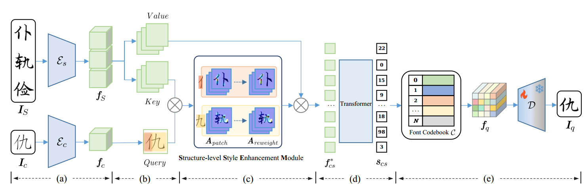
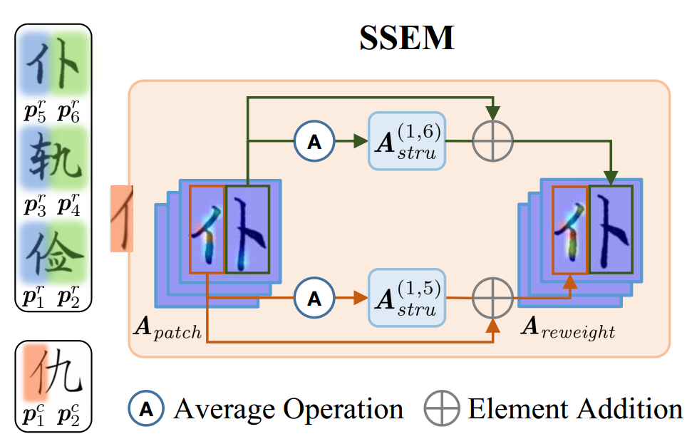
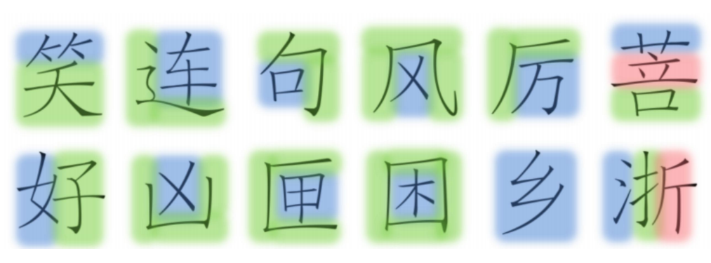

[toc]

> [VQ-Font: Few-Shot Font Generation with Structure-Aware Enhancement and Quantization](https://arxiv.org/abs/2308.14018)
>
> AAAI 2024

# 贡献

- 将 <u>*VQ-GAN*</u> 应用到字体生成上
- 沿用 <u>*Fs-Font 的思路，将 content image 作为 query，reference image 作为 key 和 value*</u>
- 将汉字<u>*字符的结构预定义为 12 种*</u> (e.g. 上下、左右 e.t.c.)，(相当于 mask) 在 <u>*component-level 上增强对应位置的 attn map*</u>

# 思路

## Framework

**VQ-GAN**

- VQ-GAN 的思路，是将提取出的 feature embedding <u>*转为有限的、离散的一组 embedding*</u> (i.e. 上图中的 <u>*Codebook*</u>)；一般通过最邻近算法实现两者的映射，在训练过程中 <u>*codebook 中的 embedding 也会被训练*</u>以更好地使用较少数量的 embedding 代表数量更多的、更多样的 feature embedding

- 沿用 <u>*Fs-Font 的思路，将 content image 作为 query，reference image 作为 key 和 value*</u>
- 将汉字<u>*字符的结构预定义为 12 种*</u> (e.g. 上下、左右 e.t.c.)，(相当于 mask) 在 <u>*component-level 上增强对应位置的 attn map*</u>该论文还将提取 feature embedding 的任务<u>*转为了预测 codebook 中 index 的任务*</u>

**Style Enhancement Module (SSEM)**

- 预定义了 <u>*12 种不同的 component 组织结构*</u>

  

- 对不同 component 的<u>*位置信息增强 attn map*</u> (猜测可能是乘上了一个标量进行放大)

## 数据集

- 382 种 font，每种 3499 字符

# Evaluation Metric

- L1
- RMSE
- PSNR
- SSIM
- LPIPS

# Ablation

- SSEM 结构有效