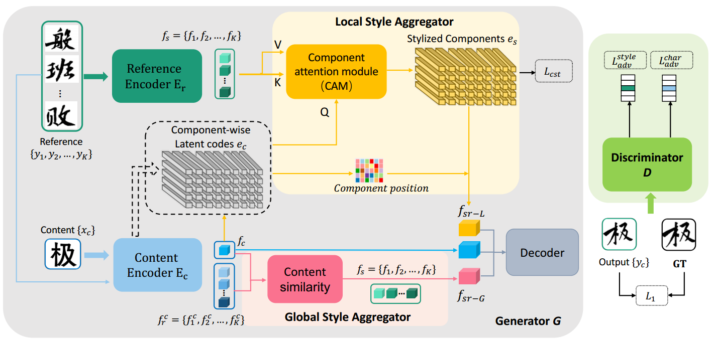

[toc]

> [Few shot font generation via transferring similarity guided global style and quantization local style](https://arxiv.org/abs/2309.00827)
>
> [源码](https://github.com/awei669/VQ-Font)
>
> ICCV 2023

# 问题提出

- 之前的工作需要预先定义字形的空间结构，不利于跨语言生成

# 贡献

- 使用 VQ-GAN 做字体生成，将 <u>*content embedding 和 style embedding 都转化为 code embedding*</u>
- 延续 Fs-Font 的思路，将 <u>*content embedding 做 query，style embedding 做 key 和 value*</u>
- 计算 content image 和 reference image 在 content 上的相似度，在<u>*生成时对更相似的 reference image 给予更大的权重*</u>

# 思路

## Framework

- 上图中的 $e_c$ 和 $e_s$ 都表示 <u>*codebook embedding*</u>

**Local Style Aggregator (LSA)**

- 将 <u>*content embedding 做 query，style embedding 做 key 和 value*</u>

**Global Style Aggregator (GSA)**

- 计算 content image 和 reference image 在 content 上的相似度，在<u>*生成时对更相似的 reference image 给予更大的权重*</u>

  在 style embedding 注入的过程中，会使用这个权重对多个 style embedding 进行加权融合

**损失函数**

- 来自同一个 font 的不同 reference image set 应该更接近，来自不同 font 的应该远离

  > 不太明白相同的逻辑，一张 reference image 改成一个 reference image set 的区别是什么；之前的工作好像都是使用一张 reference image 为单位的

## 数据集

- 386 种 font，每个 font 3,500 个中文字符

# Evaluation Metric

- SSIM
- RMSE
- LPIPS
- FID

# Ablation

- LSA 和 GSA 结构有效