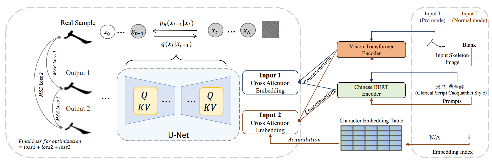

[toc]

> [Calliffusion: Chinese Calligraphy Generation and Style Transfer with Diffusion Modeling](https://arxiv.org/abs/2305.19124) (ICCC 2023)
>
> [CalliffusionV2: Personalized Natural Calligraphy Generation with Flexible Multi-modal Control](https://arxiv.org/abs/2410.03787)

# 贡献

- Calliffusion v1 只是使用了简单的 LoRA 微调方式进行训练，没有很值得借鉴的思路
- Calliffusion v2 额外<u>*引入了 skeleton*</u> (Zhang-Suen thinning algorithm) 作为 glyph 控制

# 思路

## Framework

**训练策略**

- 引入了 <u>*skeleton*</u> (Zhang-Suen thinning algorithm) 作为 glyph 控制
- 训练过程中存在两类输入 (在推理过程会存在可以切换的两条支线)，
  - 输入 skeleton + 书法描述
  - 输入书法描述 + character id

**损失函数**

- 根据两种不同的输入<u>*会产生两种输出*</u>，在 gt 和两种输出，还有输出之间计算损失函数

## 数据集

- 150 种书法 font，每个 font 4000 个字符

# Evaluation Metric

- LPIPS
- L1
- RMSE
- SSIM