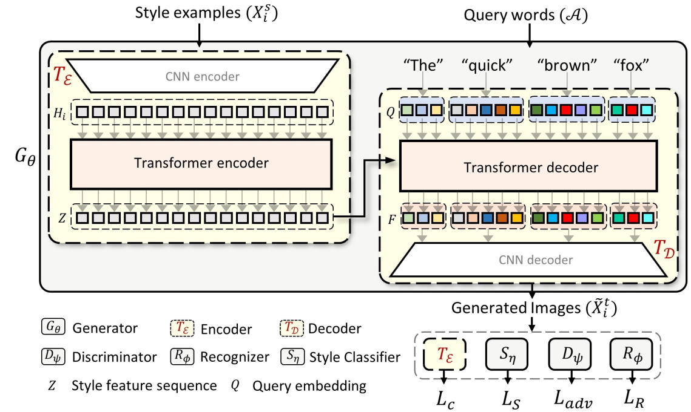
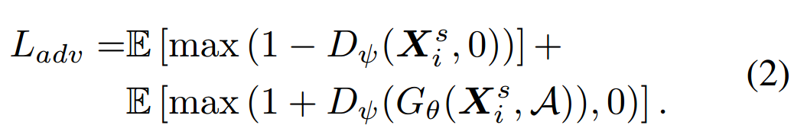
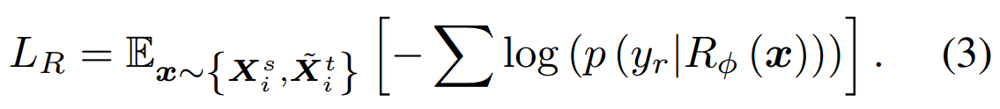
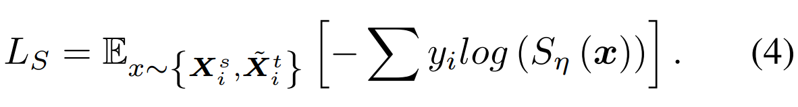
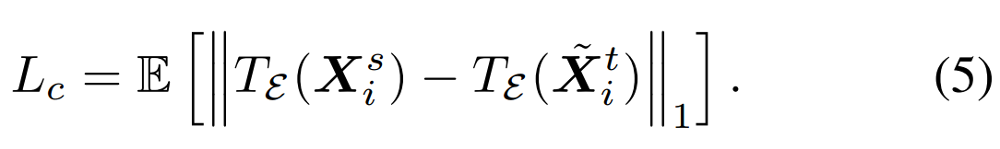
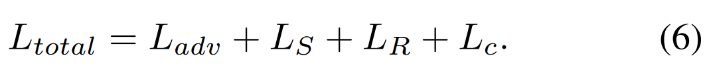

[toc]

> [Handwriting Transformers](https://arxiv.org/abs/2104.03964)
>
> [official code](https://github.com/ankanbhunia/Handwriting-Transformers)
>
> ICCV 2021

# 问题提出

- 之前的工作在对字符级别的风格学习能力不足

# 贡献

- 首个基于 Transformer 的手写文本生成模型

# 思路

**Transformer Encoder**

- 提取 style embedding

**Transformer Decoder**

- Query words 中的每个<u>*字符*</u>表示为一个 512 维向量
- Decoder 一次性生成所有的 Query word，不进行 shift right

**Loss Function**

- $L_{adv}$：借用 GAN 中的对抗损失

  

- $L_R$：识别生成文本的内容，对生成文本和 gt 文本做 CTC loss

  

- $L_S$：通过 style classifier 判断生成图像的风格做 CE loss

  

- $L_c$：将用于风格参考的 image 经过 Transformer Encoder 后的结果，与生成的图像经过 Transformer Encoder 后的结果进行 $L_1$ 损失函数计算

  

- 完整的损失函数：

  

# Limitation