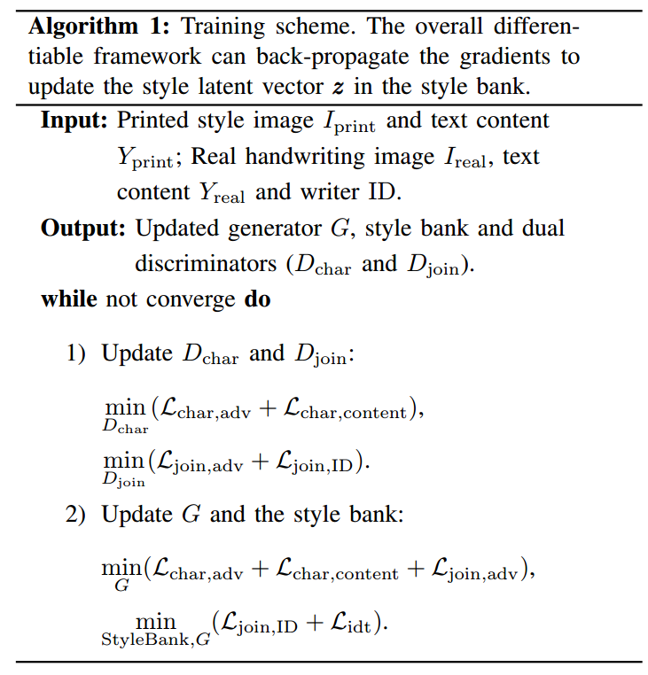

[toc]

> [SLOGAN: Handwriting Style Synthesis for Arbitrary-Length and Out-of-Vocabulary Text](https://arxiv.org/abs/2202.11456)

# 问题提出

- 对于 out-of-vocabulary (OOV) 的情况，之前的工作如果依靠单纯的数据增强是无法解决 OOV 的情况的，而重新标注 OOV 的数据又非常消耗人工

# 贡献

- 通过 patch 的方式监督字符之间连笔的绘制
- 对提取出的 style embedding 进行存储并随 generator 进行梯度更新

# 思路

**Style Bank**

- 本质是一个朴素的数据库，通过 Style ID  返回 style embedding
- 其中存储的 **style embedding 会被训练并更新**

**模型输入**

- 为了解决 OOV 问题，使用预先定义的 font **形成 content image**，以提供字形信息

**损失函数**

- **Separated Character Discriminator**
  - 对每一个字符进行**对抗损失 + 字符交叉熵损失**
  - 论文中**通过 attention map 以弱监督获取每个字符的位置**
- **Cursive Join Discriminator**
  - 通过 patch 的方式，监督字符之间的**连笔**；**对抗损失 + style ID**
- **Auto-encoder**
  - 将 generator 输入的 $I_{print}$ 修改为 $I_{real}$ (i.e. **自己生成自己**)

# Limitation