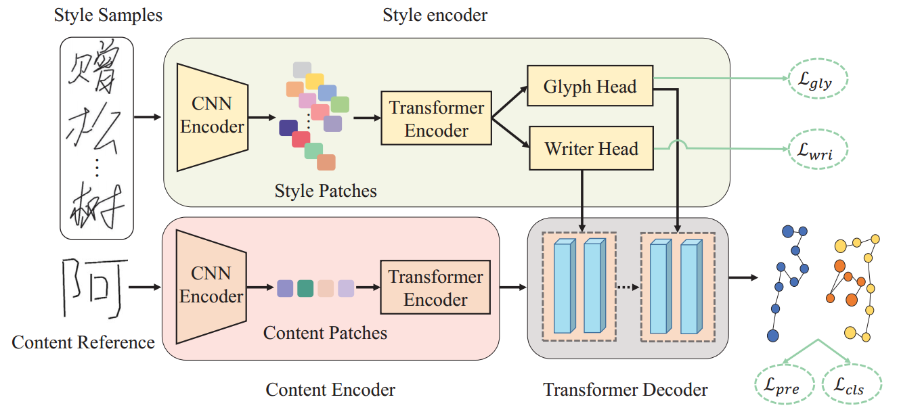
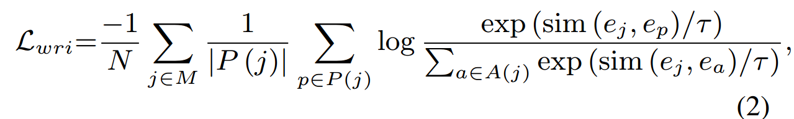
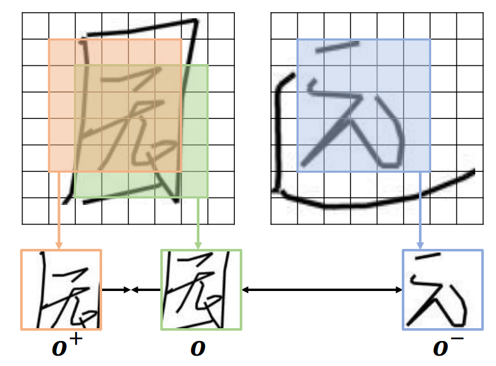
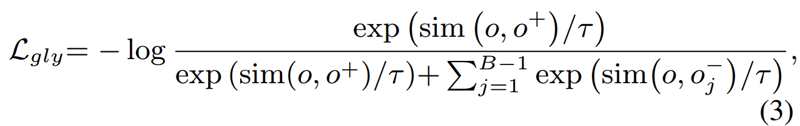
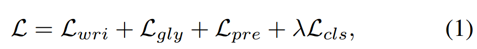
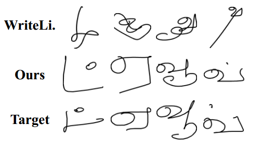

[toc]

> [Disentangling Writer and Character Styles for Handwriting Generation](https://arxiv.org/abs/2303.14736)
>
> [official code](https://github.com/dailenson/SDT)
>
> CVPR 2023

# 问题提出

- 之前的工作关注在获取一个 writer 的全局 style，但忽视了同一个 writer 内在 style 的区别

# Preliminary

- 该论文针对的是 online character，会同时记录落笔、起笔、移动等多个状态；对应的 offline character 就是单纯的图像

# 贡献

- 通过对比学习，在监督全局的 style (writer-wise) 外，监督局部的不同 style (character-wise)

# 思路

**损失函数**

- writer-wise，**同一个 writer 写的字作为正样本，不同的 writer 作为负样本**

  

- character wise，**同一个 writer 写的同一个字截取不同的 patch 作为正样本，同一个 writer 写的不同字作为负样本**

   “园” 的不同 patch 作为正样本，“远” 作为负样本

  

- 对于 online character，因为输出是各种“状态“，所以额外增加**对状态的监督**

- 完整的损失函数，

  

# Limitation

- 部分语种的生成效果不佳

  