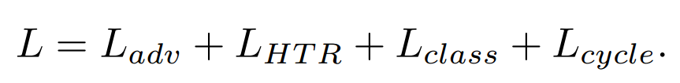

[toc]

# VATr

> [Handwritten Text Generation from Visual Archetypes](https://arxiv.org/abs/2303.15269)
>
> [official code](https://github.com/aimagelab/VATr)
>
> CVPR 2023

## 问题提出

- 之前的工作对 OOV 的支持不足

## 贡献

- 通过提供 content image 解决模型不了解 OOV 的字形知识的问题

## 思路

- Transformer Decoder 的输入是 **content image 形成的 token**

- **损失函数**

  - $L_{adv}$：一般的对抗损失

  - $L_{HTR}$：HTR (Handwritten Text Recognization) 对生成文本正确性的检测损失

  - $L_{class}$：对生成图像 style 的分类损失

  - $L_{cycle}$：gt 和生成图像经过 CNN Encoder 后计算 L1 loss

    

  - 整体损失函数：

    

# VATr++

> [VATr++: Choose Your Words Wisely for Handwritten Text Generation](http://arxiv.org/abs/2402.10798)
>
> [official code](https://github.com/EDM-Research/VATr-pp)
>
> IEEE 2025

## 贡献

- 提出一系列数据增广的方法，平衡 Discriminator 的判别能力，增强对长尾字符的学习

## 思路

**数据增强**

- **Style Input Preparation**

  在一些数据集中，特殊字符 (e.g. 标点) 会被放缩为和字符一样的大小，这破坏了原先的上下文信息；该论文**将这些特殊字符组合到相邻的字符中**

  

- **Text Input Preparation**

  数据集中对于罕见/长尾字符的出现频率较低、搭配较单一，使得模型的学习难度增加

  在提供 visual token 前，**每个字符都有 $\alpha P_k$ 的概率被替换为一个长尾字符**，其中 $P_k$ 表示字符 $k$ 在整个数据集中的出现频率；而用于替换的长尾字符则是**按照出现概率反选 $1-P_k$**；默认设置 $\alpha=0.4$

- **HTR Model Regularization**

  对于一些长尾字符，**Discriminator 可能会 overfit 到某个特定的 writer 上**，导致倾向于给出 fake 的判断 (i.e. 本质上是 Discriminator 的训练不足)；论文提出**对训练数据进行增广**

   增广时会尽量保证字形不受到很大的影响

- **Discriminator Regularization**

  论文设置 30% 的数据会被随机裁剪，要求 **Discriminator 仅通过 patch 进行判别** (i.e. 更关注笔画等细节)

   防止 Discriminator 在训练中判别能力过强，导致 Generator 训练困难

