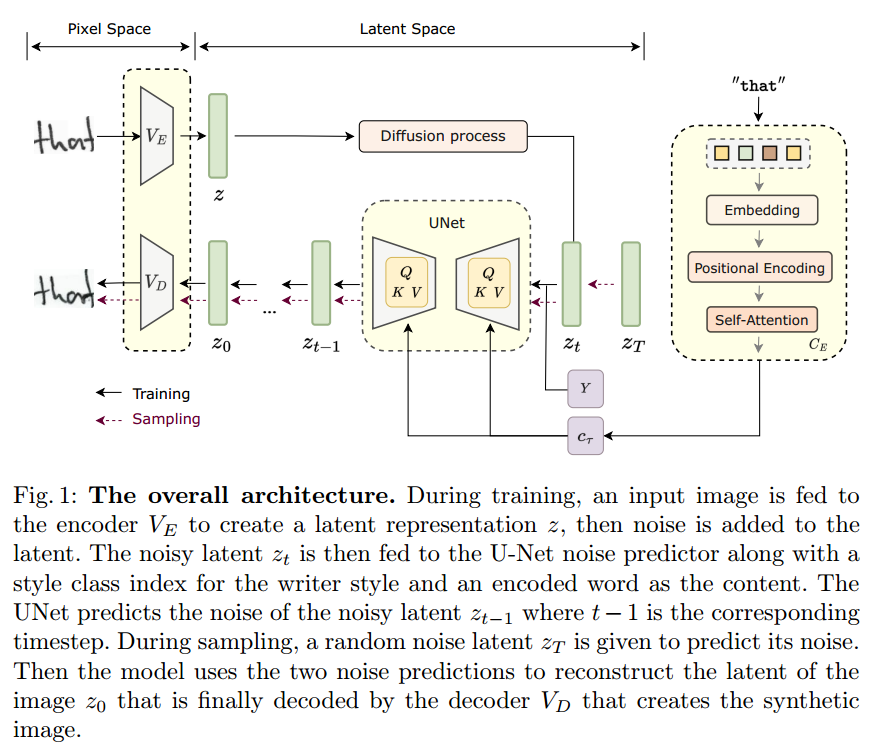

[toc]

> [WordStylist: Styled Verbatim Handwritten Text Generation with Latent Diffusion Models](https://arxiv.org/abs/2303.16576)
>
> [official code](https://github.com/koninik/WordStylist)
>
> ICDAR 2023

# 问题提出

# 贡献

- 第一个用 diffusion model 做 HTG 的模型

# 思路

**扩散模型输入**

- <u>*纯文本*</u>转为 embedding 后当做 context，<u>*style 当做 class*</u> 经过 embedding 和 time_emb 加法融合
- 生成单位是字母 (e.g. 'hello' 这个单词要采样 4×sample_timesteps 次)；对字母进行编码 (论文中一个字母 10 个 token，不够的补 pad)，对 embedding 之后的 token 做**位置编码**，然后再对 token 做 **self-attention**

