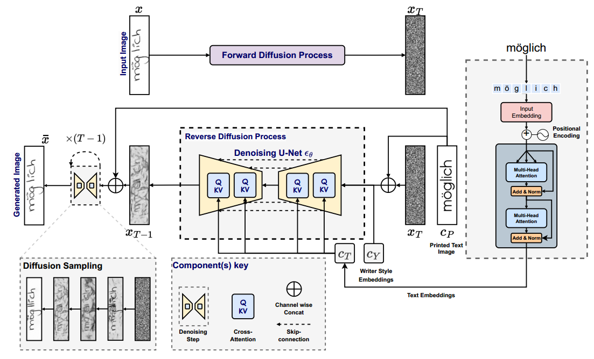

[toc]

> [StylusAI: Stylistic Adaptation for Robust German Handwritten Text Generation](https://arxiv.org/abs/2407.15608)
>
> ICDAR 2024

# 问题提出

- 之前的方法对跨语言的支持不足

# 贡献

- 将 HTG 设计为一个 i2i 任务
- 较为现代的扩散模型，搭配 cross-attn 注入、timestep 注入等经典方式

# 思路

**扩散模型输入**

- **Printed Text image (i.e. content image) 和 $x_T$ 在 channel 上 concat**
- 以 **character-level 对字符从 text (不是 visual) 角度进行编码**，通过 **cross-attn** 注入
- **writer style embedding 和 timestep embedding 使用相同的注入方式**