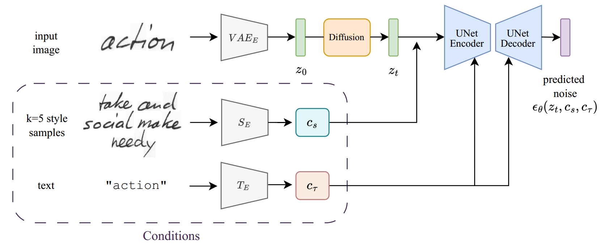
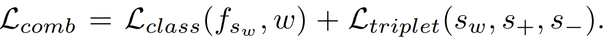
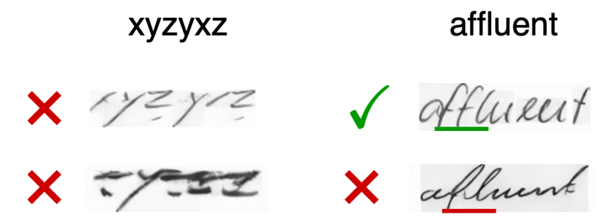
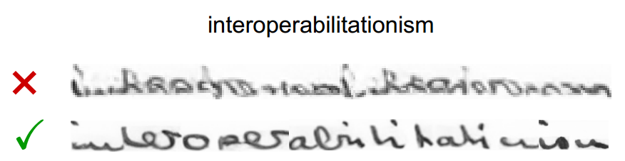

[toc]

> [DiffusionPen: Towards Controlling the Style of Handwritten Text Generation](https://arxiv.org/abs/2409.06065)
>
> [official code](https://github.com/koninik/DiffusionPen)
>
> ECCV 2024

# 问题提出

- 之前的 GAN 方法在训练和效果上都存在不足

# 贡献

- 在 diffusion 上进行 HTG 的又一尝试

# 思路

**扩散模型输入**

- Style Encoder，使用 **triplet loss 和 style classifier loss** 进行训练

  

  论文设置 $k=5$ 个单词作为 reference

- Text Encoder，**在 character level 上在 text (而非 visual) 空间中进行编码**

**引入多样性**

- 该论文还提出通过对 style embedding 的增强来**增加生成结果的多样性**
  - 对 style embedding 使用**插值**实现
  - 直接**向 style embedding 添加随机噪声**
  - 将初始化噪声**替换为加噪的 target style 的图像** (i.e. 转为 i2i 任务)

# Limitation

- (左) 对于 OOV 的文本生成效果不佳，(右) 有时候风格过于强烈，导致可读性降低
-  (上) 对长单词的生成效果有限，(下) 但是可以将一个长单词的生成拆分为多个部分生成