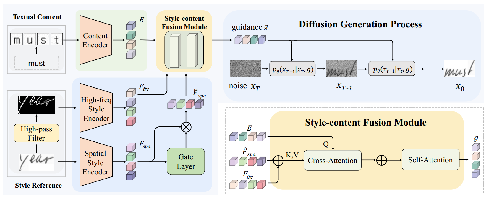
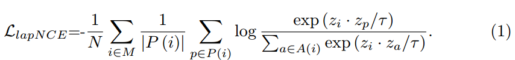
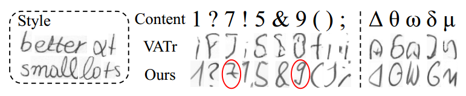

[toc]

> [One-Shot Diffusion Mimicker for Handwritten Text Generation](https://arxiv.org/abs/2409.04004)
>
> [official code](https://github.com/dailenson/One-DM)

# 问题提出

- 之前的工作集中在 few-shot 场景上，该论文认为用户想要的 HTG 是一个 one-shot 任务

# 贡献

- 从低频、高频两个方向对 style embedding 进行提取

# 思路

**High-freq Style Encoder**

- 论文认为**高频信息**更好地学习到了**笔画、倾斜等细节**
- Style Encoder 使用**对比学习**进行训练 

**Spatial Style Encoder**

- 论文认为低频信息则更好保存了空间等全局信息
- 但是低频信息存在较多背景噪声，所以使用**门控机制对背景噪声进行过滤**

**Style-content Fusion Module**

- 通过 attention 机制融合 textual content 和高频、低频 style

  > 结构图是 concat 实现，代码中是串行进行 attention

# Limitation

- 对于 OOV 的生成存在不足

   数字在训练数据集中占比较少，希腊字母则是不存在