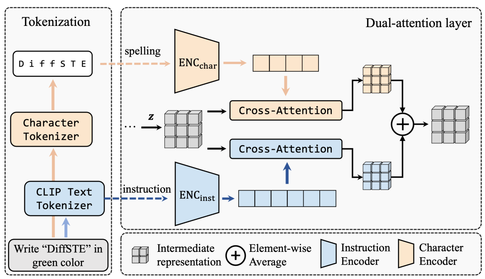

[toc]

> [Improving Diffusion Models for Scene Text Editing with Dual Encoders](https://arxiv.org/abs/2304.05568)
>
> [源码](https://github.com/UCSB-NLP-Chang/DiffSTE)
>
> TMLR 2024

# 贡献

- 借用 NLP 中 <u>*Instruction Tuning*</u> 的思路；提出一个 <u>*Dual-Encoder*</u> 结构，$ENC_{inst}$ 沿用 CLIP Encoder <u>*对 Instruction 进行编码*</u>，$ENC_{char}$ 在 <u>*character-level 上对需要生成的文本编码*</u>

# 思路

## Framework

- 使用 SD (估计是 1.5) 的结构训练

### Instruction Tuning 与数据集

> 什么是 Instruction Tuning
>
> 举个简单的例子，`Instruction：“将以下句子翻译成英文：今天天气很好。”`，期望模型做出的回答 `“The weather is nice today.”`

- **Instruction**：类似于 `Write “TEXT” in color: COLOR and font: FONT.`；会随机丢弃 Instruction 中的 color 和 font

- $ENC_{inst}$ 沿用 CLIP Encoder <u>*对 Instruction 进行编码*</u>

  $ENC_{char}$ 在 <u>*character-level 上对需要生成的文本编码*</u> (但是文本中并没有明确网络结构)

  <u>*通过 cross attention 对 embedding 进行融合*</u>，分别产生两个输出然后<u>*求平均*</u>

- **数据集**

  - 人造数据集：

    1. 选择文本内容、颜色、字体
    2. 渲染出指定的文本
    3. 进行旋转和透视变换
    4. 放置到收集到的真实背景图像上
    5. 随机 mask 文本

  - 真实数据：

    1. 使用 OCR 检测文本

       由于没有同时检测颜色、字体等属性，所以这些图像的 Instruction 仅构建 `Write “TEXT”`

# Evaluation Metric

- OCR Acc

- Cor：人工评估

  > 字体、颜色、图像自然度都是人工评价的，感觉说服力会有一点不足

# Ablation

- Dual-Encoder 的设计有用

- DiffSTE 可以用于两种字体融合 (i.e. Instruction 使用类似 `“Write “TEXT” in font: FONT1 and FONT2”`)

  DiffSTE 可以进行 zero-shot 字体生成 (i.e. 在 Instruction 中指定没有在训练中使用过的字体名，e.g. bold)

- 可以仅使用类似 `Write “TEXT”` 的 Instruction，在不指定 color、font 等 style 的情况下生成符合图像风格的文本

- 可以使用自然语言生成 (i.e. 不使用 Instruction 而类似 `"使用天空的颜色写上XXX"`)

- 可以 mask 掉不规则的区域，并可以生成符合区域的文本

> 但毕竟是早期的工作，虽然能做到但不是都做的很好