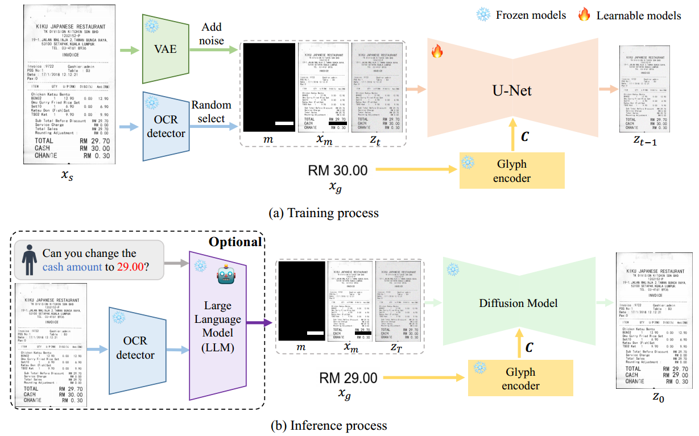

[toc]

> [DiffUTE: Universal Text Editing Diffusion Model](https://arxiv.org/abs/2305.10825)
>
> [源码](https://github.com/chenhaoxing/DiffUTE)

# 贡献

- 提出了一个基于 diffusion model 的 inpainting 模型；通过 <u>*OCR + Pillow 提供字形信息*</u>，<u>*mask 提供位置信息*</u>
- 提出了一个 progressive training strategy (PTT)，以<u>*不同分辨率的图像逐渐进行训练*</u>

# 思路

## DiffUTE Framework

- 使用 stable-diffusion-2-inpainting 的结构和权重；OCR detector 使用 PP-OCR，Glyph encoder 使用 Tr-OCR

- <u>*VAE 训练*</u>，

  - 预训练的 VAE 在文本上 (e.g. 字号较小的文本) 的表现不佳，因此论文中重新进行了训练
  - 论文中提出了一种<u>*渐进式的训练*</u>，i.e. gt 图像会<u>*以 S/8，S/4，S/2，S/1 的比例被剪裁然后上采样还原到原始大小*</u>，<u>*先在字号较大、比较容易学习的图像上训练*</u>，然后逐渐过渡到在原始图像上训练
  - 使用 l2 loss

- <u>*UNet 训练*</u>是一个无监督框架，

  - 对于原始图像 $x_s$，使用 OCR 检测出 gt 中文本的 bbox 并转为 mask (i.e. 位置信息)

    将上一时间步的输出 $z_t$，mask 图像 $m$，masked image 图像 $x_m$ <u>*在 channel 维度上拼接*</u>

  - 此外，还使用 OCR 提取出文本的内容 (i.e. 字形信息) 并<u>*使用 Pillow 以固定的字体和字号重新绘制*</u>被 mask 掉的文本

    TR-OCR 是 transformer encoder-decoder 结构，将 <u>*transformer encoder 提取的 feature*</u> 作为 SpatialTransformer 的 <u>*key、value 输入*</u>

  - 损失函数仅使用重建损失

- 在推理过程中，通过接入 ChatGLM，用户可以通过对话表示要修改图像上的什么部分，而不需要手动绘制 mask

## 数据集

- 训练数据量 5M
- 数据不开源

# Evaluation Metric

- OCR

  > 但具体怎么计算没有说

- Cor：人工评定

# Ablation & Limitation

- 剪裁不同大小的图像训练 VAE 是有用的

- 通过 Glyph ecoder 提供额外的字形控制是有效的

- 通过 mask 提供位置信息是有效的

---

- 无法生成过长的文本

- 被替换的文本和目标文本如果不同长度，生成效果可能下降

  > [作者对该问题的回复](https://github.com/chenhaoxing/DiffUTE/issues/16)
  >
  > 但是很难说这是否是个 limitation，毕竟有限的空间中写过长的 word 怎样都是不太可能的