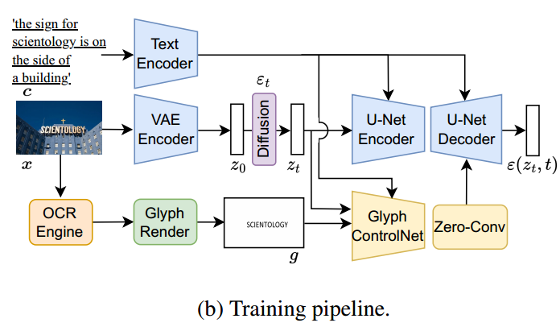

[toc]

> [GlyphControl: Glyph Conditional Control for Visual Text Generation](https://arxiv.org/abs/2305.18259)
>
> [源码](https://github.com/AIGText/GlyphControl-release)
>
> NeurIPS 2023

# 贡献

- 模仿 ControlNet 的思路，提出了 <u>*Glyph ControlNet*</u>
- 提出了 <u>*Glyph Instruction*</u>，用户能以配置文件的方式设计文本，再通过 Pillow 绘制“草图”
- 提出了 <u>*LAION-Glyph*</u> 数据集


# 思路

## GlyphControl Framework

- 基本使用了 <u>*ControlNet 的结构*</u>，可以看做是提出了<u>*一种新的控制信息*</u>并进行训练，i.e. Pillow 绘制出的“草图”



- 模型使用 SD v2 并且使用了其权重作为基础权重；使用 PP-OCR v3 进行文本识别等操作

> 损失函数只有原始的重建损失，虽然 Glyph Instruction 中有对布局和其他属性的控制，但是并没有使用损失函数进行监督


## Glyph Instruction

- 通过配置文件的方式可以对布局、字符属性、字符内容等进行控制

  ```yaml
  # GlyphControl-release-main\glyph_instructions.yaml
  
  Instructions:
    rendered_txt_values: ["APPLE"]
    # the width of the OCR box (i.e., the font size)
    width_values: [0.3] 
    # the width-height ratio of the OCR box, if the ratio == 0, the ratio will be set as optimal ratio
    ratio_values: [0] 
    # the relative coordinates of the top left corner of the OCR box
    top_left_x_values: [0.35]
    top_left_y_values: [0.4]
    # the yaw rotation angle of the OCR box ([-20, 20])
    yaw_values: [0] 
    # the number of rows where the text will be placed
    num_rows_values: [1]
  ```

  > GlyphControl 在颜色、字体等属性上并不支持

- Pillow 绘制的“草图“中文字的大小、位置等会直接反应到生成出的图像中

  > 所以理论上在制作数据集的时候，OCR 不止需要识别出文本的内容，还需要位置、大小等额外的信息
  >
  > 同时，如果字很大或很小 (i.e. 大小在训练数据中比较罕见)，生成效果也会下降


## LAION-Glyph 数据集

- SD 在名为 LAION-5B 的数据集上进行过训练，论文从 LAION-2B-en 这个子数据集中，对含有文本的图像进行筛选，得到了 <u>*LAION-Glyph-100K, LAION-Glyph-1M, LAION-Glyph-10M*</u> 三个不同量级的数据集

  > 根据 issue 的反映，貌似数据集下载链接挂掉了

- 数据集的<u>*筛选、构建过程、基本信息*</u>包括，

  - 美学评价

    > 论文中好像没有具体说是用什么做的美学评价

  - 检测到文本的 bbox 都在边缘附近的图像会被丢弃

  - n_bbox > 5 或 bbox 总面积不足图像 5% 会被丢弃

  - BLIP-2 重新生成 caption

    > rebuttal 的时候作者有说 BLIP-2 有时候确实无法对有文本的图像生成完全符合文本内容的 caption，所以看来 OCR 检测的对不代表 caption 一定是对的

  - 每个图像 10 到 50 个 character，3 到 5 个 word，1 到 5 个 bbox


# Evaluation Metric

- 通过 OCR 提取出生成图像中的文字，然后计算 Levenshtein Distance (i.e. 比较字符串相似度的一种方法，指通过替换、插入，需要多少步可以把一个字符串变为另一个字符串)

  论文中还对大小写敏感和大小写不敏感分别进行了评估

- CLIP score

- Simple Bench 和 Creative Bench；两者的区别在于提示词模板的复杂程度，前者更简单

  对于提示词模板中需要填入的文本 (i.e. 需要生成的文本)，对常用词和生僻词分别作了评估

- FID


