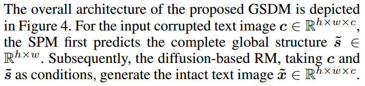
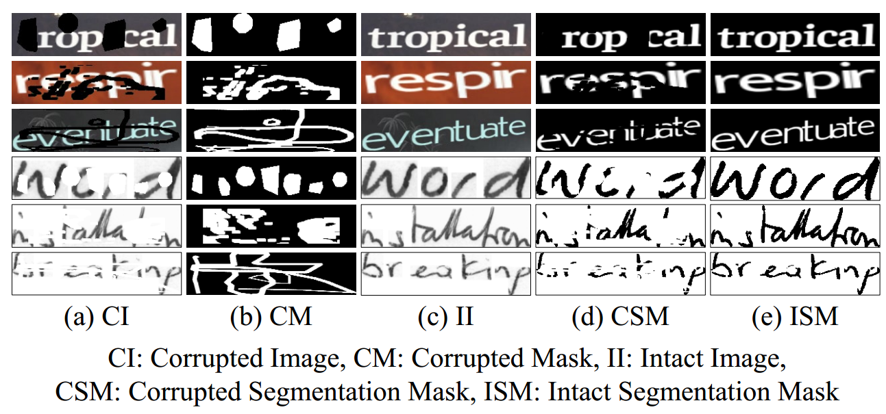

[toc]

> [Text Image Inpainting via Global Structure-Guided Diffusion Models](https://arxiv.org/abs/2401.14832)
>
> [official code](https://github.com/blackprotoss/GSDM)
>
> AAAI 2024

# 贡献

- 一个用于对部分缺失的字符图像 (corrupted image) 进行补全的模型
- 提出一个**二阶段的模型**（1）先预测出 segmentation mask (i.e. 文本区域的 mask)（2）将上一步预测出的 seg mask 作为额外的信息，生成补全后的图像

# 思路

## Framework

**第一阶段：Structure Prediction Module (SPM)**

- 使用一个 DM 对 seg mask 进行预测；**输入 CI 预测 ISM，预测出的 ISM 将用于第二阶段的进一步修复**

  > 原文：
  >
  > 
  >
  > 参考数据集中的 CSM 和 ISM，
  >
  > 
  >
  > 猜测这个数据集可能是先生成 ISM 然后随机腐蚀，因为是人造腐蚀就可以轻松拿到 CM 和其他的数据

- **损失函数：**

  

  > 公式 (2) 中的 N 表示像素总数

  
  
  - 公式 (1) (2) 监督 seg mask 的空间信息；公式 (3) (4) 监督文本的可读性，$\phi_{Rec}$ 类似 OCR model，$Gram$ 指 Gram matrix 可以简单看做是一个 training-free 的 style encoder

**第二阶段：Reconstruction Module**

- 一个普通的 DM

## Dataset

> [数据集地址](https://github.com/blackprotoss/GSDM?tab=readme-ov-file#datasets-and-pre-trained-checkpoints)

