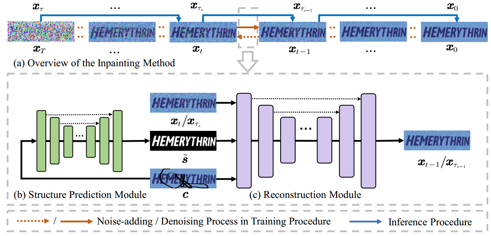
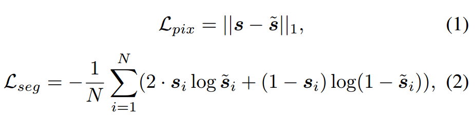
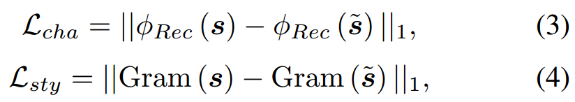

[toc]

> [Text Image Inpainting via Global Structure-Guided Diffusion Models](https://arxiv.org/abs/2401.14832)
>
> [official code](https://github.com/blackprotoss/GSDM)
>
> AAAI 2024

# 贡献

- 一个用于对部分缺失的字符图像 (corrupted image) 进行补全的模型
- 提出一个**二阶段的模型**（1）先预测出 segmentation mask（2）将上一步预测出的 seg mask 作为额外的信息，生成补全后的图像

# 思路

## Framework

**第一阶段：Structure Prediction Module (SPM)**

- 使用一个 DM 对 seg mask 进行预测‘

  > 原文：To address this challenge, we propose the Structure Prediction Module (SPM), which utilizes a single U-Net (Ronneberger, Fischer, and Brox 2015) to predict the correct foreground segmentation masks of intact images via the corrupted ones.
  >
  > 论文中说的是预测 seg mask，但是图上画的 $\tilde s$ 是文本图像，用的损失函数也有监督文本的可读性，可能是两者都会生成？

- **损失函数：**

  

  

  - 公式 (1) (2) 监督 seg mask 的空间信息；公式 (3) (4) 监督文本的可读性，$\phi_{Rec}$ 类似 OCR model，$Gram$ 指 Gram matrix 可以简单看做是一个 training-free 的 style encoder

**第二阶段：Reconstruction Module**

- 一个普通的 DM

## Dataset

> [数据集地址](https://github.com/blackprotoss/GSDM?tab=readme-ov-file#datasets-and-pre-trained-checkpoints)

