[toc]

> [TextCenGen: Attention-Guided Text-Centric Background Adaptation for Text-to-Image Generation](https://arxiv.org/abs/2404.11824)
>
> [official code](https://github.com/tianyilt/TextCenGen_Background_Adapt)
>
> ICML 2025

# 问题提出

- 之前的工作缺少对“文本”与”背景“想融洽布局且保质量的生成任务的研究

# 贡献

- 模仿物理中的斥力计算，将 attn map 整体移动以为 text 区域空出 attn score “真空”

# 思路

> 这是一个 <u>*training-free*</u> 的方法

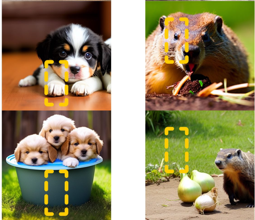 (上) 不使用 TextCenGen，文本 bbox 和背景有较大的重叠，(下) 使用 TextCenGen，背景被“推离“ 文本 bbox

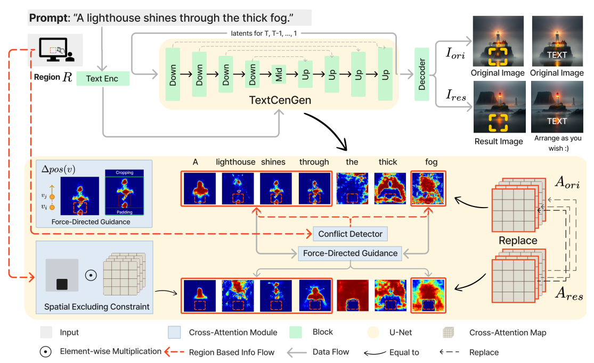

**Conflict Detector**

- 该论文将 cross attn map 视作包含位置信息的 mask；$A^l_{w,h,k}$ 表示第 $k^{th}$ 个 token 在第 $l$ 层 $size=(h,w)$ 的 cross attn map，$R$ 表示文本的 bbox

  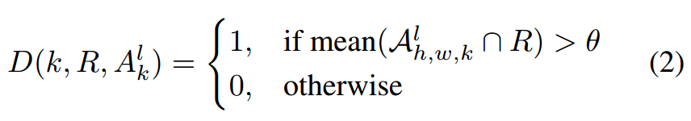

  如果 **$R$ 区域的注意力均值超过 $\theta$** (对于 50 step 的推理步数，去噪的前 20 步为 $0.14$，后 30 步为 $0.8$)，则表示文本被遮挡，需要处理 conflict

  - 如果**不需要处理 conflict，那么 $R$ 区域内的 attn score 也会被置零**

**Centroid of Object**

- 该论文在解决 conflict 的过程中借用了很多物理学知识，其中之一是使用<u>*“质心”*</u>来简化计算

- **将 attn score 看做密度，通过质心公式计算**，

  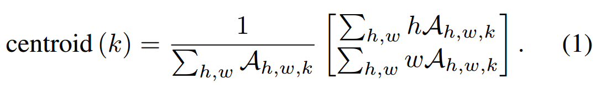

  > 仅从公式上看不知道是一个 token 一个质心，还是一个 token 每一层一个质心

**Solve Conflict**

- 论文提出了两种方法来解决冲突，

  - **Repulsive Force**，对于 $n$ 个 text bbox，$p(v_i)$ 表示 token 对应的质心，$p(tar_j)$ 表示 bbox 的质心，$\xi$ 是一个超参数，$w_j$ 也是一个超参数，用于指定每个 text bbox 对 repulsive force 的贡献程度

    

    为了防止 $F_{rep}$ 的值过大，进行归一化处理 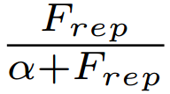，$\alpha$ 是一个超参数

  - **Margin Force**，$d$ 表示质心 $p(v_i)$ 和最近边框的距离，$m$ 是一个超参数，

    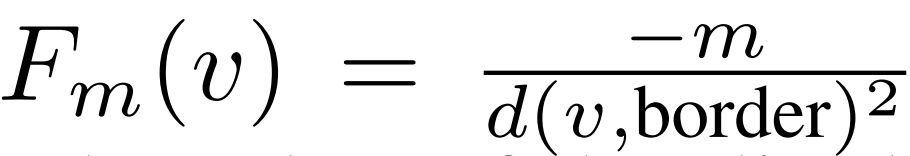

  - 以上两者的**合力**，决定了该 token 对应的 cross attn map 中**每个像素的移动方向**

    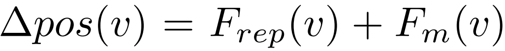

**防止过度移动**

- $\Delta pos(v)$ 可能导致部分区域被移除边界，对于这个部分直接丢弃，空白部分则使用 0 来填充

- 但是，如果连 **$p(v_i)$ (i.e. 质心) 都被移出了边界**，那么论文认为就需要被额外干预

  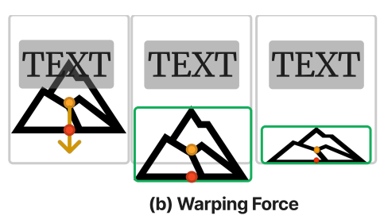 论文中称作 Warping Force，图中的“山“被压缩了

  如果 $\Delta pos(v)$ 移动后质心 $v$ 被移出了 border，那么通过仿射变换压缩会 border 内，

  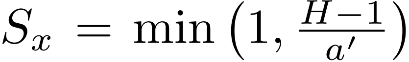，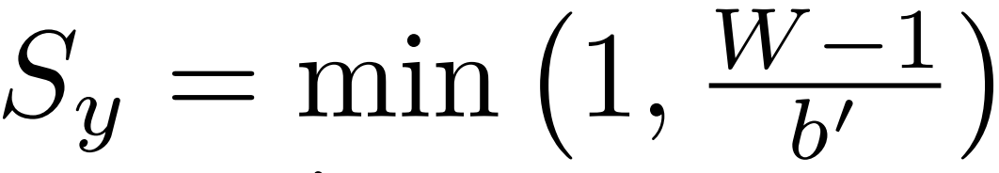，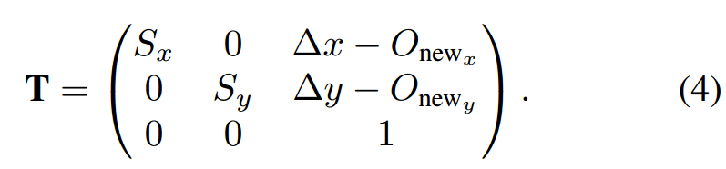

# Limitation

- 一些情况下 attn score 层面的控制仍然不足以留出足够合适的“空间”

  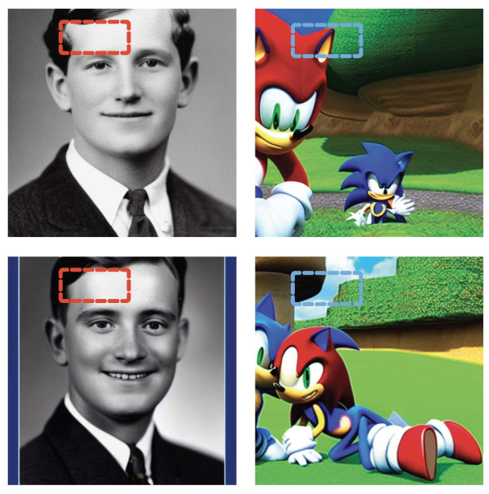 (左) 空间留到了额头上，(右) text bbox 内容生成了其它物体