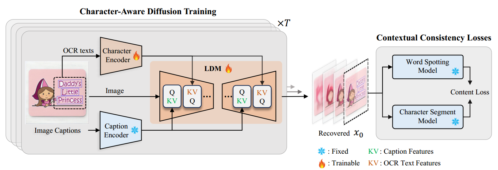
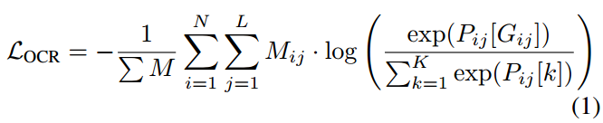
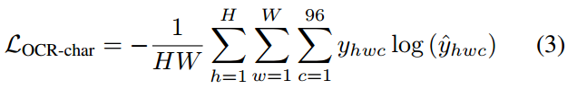
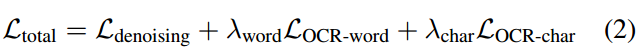

[toc]

>[Layout Agnostic Scene Text Image Synthesis with Diffusion Models](https://arxiv.org/abs/2406.01062)

> 感觉这一篇不太行，像是复刻了一遍 TextDiffuser，也没有中什么会好像，而且代码还不开源

# 贡献

- 基于 <u>*character-level 的视觉文本编码器*</u>；通过额外的 <u>*cross attention 层输入字形信息*</u>
- 提出了基于 <u>*character-level 的 OCR loss*</u> (监督字形) 和 <u>*segmentation mask loss*</u> (监督位置)

# 思路

## SceneTextGen Framework

### Character-Level Encoding

> 论文中好像没有给出这部分的网络结构

- 通过 OCR 提取出文本，然后<u>*在 character-level 上进行 tokenization*</u>

  > 可能是在检测过程中 bbox 是以 character 为单位的，然后将 bbox 转为 visual token

### Cross Attention 层处理字形信息

- 如上面的网络结构图，Character Encoder 的输出作为 <u>*key、value*</u>

  > 前一个 cross attention 应该是 SpatialTransformer 中原始的，所以应该是多加了一层上去

### 基于 character-level 的 OCR loss 和 segmentation mask loss

- OCR 会得到一个 `(N, L, K)` 的张量，表示 N 个 word 被检测到，L 表示其中最长 word 的长度，K 是 character set 的大小 (e.g. `(i, j, k)` 表示第 i 个 word 的第 j 个 character 是在 character set 中第 k 个字符的概率)；$G_{ij}$ 表示第 i 个 word 的第 j 个 character 应该是什么字符 (i.e. gt)；$M_{ij}$ 是二元矩阵 (应该是因为 $L$ 是最长长度，所以会有无效的位)

  在经过 VAE decoder 后，计算 CE loss

  > 既然是 word-level 的，检测到的 N 个 word 应该需要排序，才能和 gt 对应起来

- 不经过 VAE decoder，通过 TextDiffuser 中收集到的 character-level 的 segmentation mask 的 gt，与 OCR 在生成图像中提取到的 mask 计算 CE loss

  > 可能因为 mask 只有 0 或 1 所以使用的是 CE loss

- 完整的 loss，

## 数据集

- 来自 TextDiffuser 的 MARIO-10M 

# Evaluation Metric

- OCR-Acc

- CLIP score

- 字体分布：通过可以检测字体的 OCR model，与真实图像的 font 分布进行对比

- bbox 分布：OCR 检测得到的 bbox (可能是中心点) 的坐标的分布，与真实图像的分布进行对比

  > TextDiffuser 通过模型来预测文本应该在生成图像中的位置，然后将 mask 作为输出控制信息的一部分；而这篇论文应该是想尝试跳过这一步骤，不提供 mask (所谓的 Layout Agnostic)
  >
  > 但是我很好奇，相同的数据为什么在分布上这篇论文就能更接近真实分布

# Ablation

- loss 的设计是有效的

