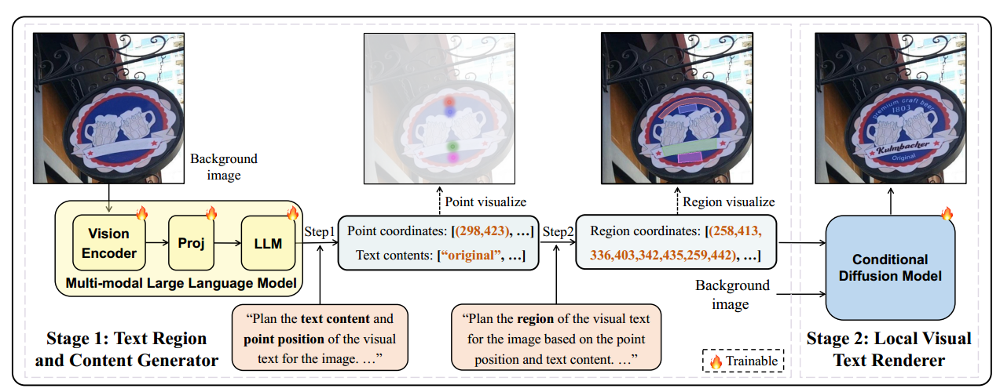
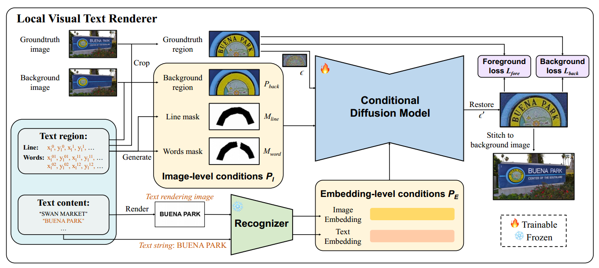
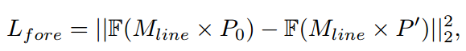
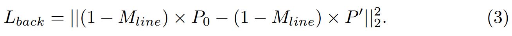
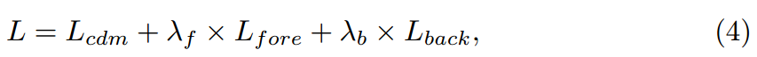

[toc]

> [Visual Text Generation in the Wild](https://arxiv.org/abs/2407.14138)
>
> [源码](https://github.com/AlibabaResearch/AdvancedLiterateMachinery/tree/main/AIGC/SceneVTG#visual-text-generation-in-the-wild)
>
> ECCV 2024

# 贡献

- 构建了一个二阶段模型（1）使用<u>*多模态视觉大模型 MLLMs*</u> 对布局进行预测（2）使用 diffusion model 进行 inpainting 任务

- 提出了专用于 inpainting 任务的 <u>*SceneVTG-Erase 数据集*</u>

# 思路

## Framework

**第一阶段：**

**第二阶段：**

### 第一阶段：Text Region and Content Generator (TRCG) —— 进行 layout 预测

- 对 MLLMs 进行微调 (论文中使用 LLaVA-v1.5-7B)

- 整个预测过程被拆分为两个阶段，
  1. 输入一张没有文本的背景图，模型首先需要预测<u>*哪些空白位置适合书写文本*</u> (这一阶段以 <u>*keypoint 的形式*</u>输出，i.e. 上图中仅输出一组坐标)，以及这些位置适合书写<u>*哪些文本*</u> (i.e. 上图中的 `"Text contents"`)
  2. 在上一阶段布局的基础上，进行更细致的布局规划 (论文中应该是为每个 keypoint 输出一个由 <u>*8 个点框定的多边形 mask*</u>)

### 第二阶段：Local Visual Text Renderer (LVTR) —— 进行 inpainting 绘制

1. 根据上一阶段输出的 8 个点，将附近 10% 的面积 crop 出来

2. 通过 8 个点绘制出 $M_{line}$

   > 这里的 $M_{word}$ 不知道是如何绘制出来的

   将<u>*无文本的背景图 $P_{back}$，$M_{line}$ 和 $M_{word}$ 组成 $P_l$，然后和加噪的 $P_t$*</u> (论文中的意思应该是进行图生图的训练) 一起作为视觉部分的输入 (论文中没有提到 ControlNet，可能是直接在通道上 concat 了)

3. 将纯文本形式的 Text string 和使用 Pillow 渲染的 Text rendering image 提供给 OCR 模型提取 embedding

   > 这里不知道 Text string 是通过 OCR 模型提取 embedding 的

- <u>*损失函数*</u>，

  - 噪声预测损失

  - 前景损失 $L_{fore}$，通过 $M_{line}$ crop 出文本相关的区域，通过 OCR 提取 embedding 然后计算 MSE

    

  - 背景损失 $L_{back}$，与 $L_{fore}$ 相对应

    

  - 完整的损失函数，

    

## 数据集 SceneVTG-Erase

> [数据集地址](https://www.modelscope.cn/datasets/Kpillow/SceneVTG-Erase)

- 数据集中没有文本的图像，是通过专门用于文字擦除的模型进行处理的
- 更多数据的信息可以参考论文的附录 "C Details for SceneVTG-Erase datasets"

# Evaluation Metric

- FID
- OCR Acc

# Ablation

- 可以用于人造数据集，并应用于其它模型的训练 (e.g. STR 模型的训练)
- 对 MLLMs 的 visual encoder 也进行训练是有效的
- 在进行布局预测时，分为 2 阶段 (先 keypoint 后 bbox) 是有效的
- $M_{line}$ 与 $M_{word}$ 的设计是有效的
- 损失函数有效

