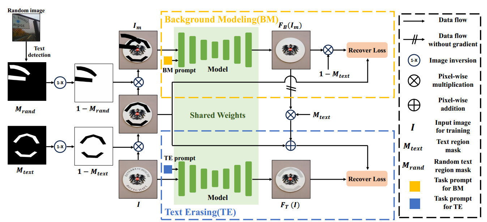
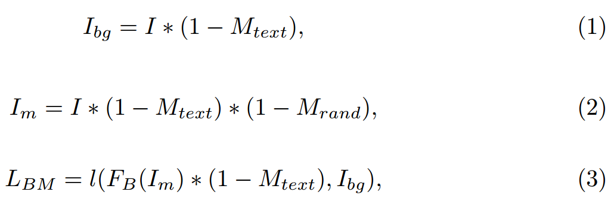
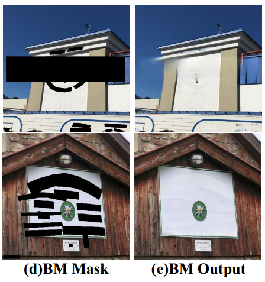
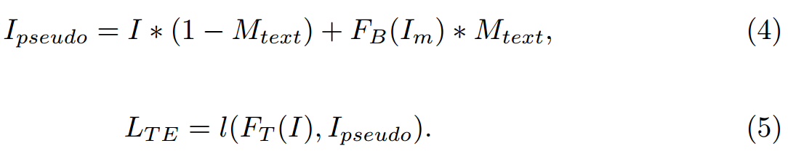

[toc]

> [Leveraging Text Localization for Scene Text Removal via Text-aware Masked Image Modeling](https://arxiv.org/abs/2409.13431)
>
> [official code](https://github.com/wzx99/TMIM)
>
> ECCV 2024

# 贡献

- 将 **inpainting 模型和 text removal 模型结合在一起**（1）利用 inpainting 的数据集和训练方式让模型学会恢复无文本区域的能力（2）再让模型学习识别文本，并利用复原无文本区域的能力进行文本的擦除

# 思路

## Preliminary

- 论文中的 scene text removal 模型应该是支持在不指定 mask/bbox 的情况下对文本进行擦除的

  > 如果不支持的话，BM 就足够完成任务，TE 的训练就没意义了

## Framework

**Background Modeling (BM)**

- $M_{rand}$ 来自**另一个随机图像的文本区域的 mask**，在公式 (3) 中复原后的图像只在 $(1-M_{text})$ 的部分计算损失函数，i.e. 仅对随机图像的文本区域的 mask 对应的**这张图像的无文本区域的复原进行监督**

  

  > 原文：By utilizing $M_{rand}$ collected from real-world text region masks, our BM stream enables the model to adapt to the shapes of text regions, enhancing its ability to remove texts. 
  >
  > 按照论文的说法，使用 $M_{rand}$ 的原因是模型要<u>*学习的是符合文本形状分布的区域进行补全*</u>
  >
  > 根据效果图，虽然没有对 $M_{text}$ 部分进行显示的监督，但是 $M_{text}$ 部分仍然较好地抹去了文本，可以**作为人造的 gt 使用**
  >
  > 
  >
  > 猜测原因是因为，由于监督的是背景的生成，所以 $M_{text}$ 的部分拥有的 <u>*zero shot 能力也是按照背景 (无文本) 的样子去复原*</u>，间接实现了抹去文本的目标

**Text Erasing**

- 这部分是比较传统的 text removal 模型的训练流程

  

**Prompt-based Multi-task Learning**

- 网络结构图中有 BM prompt 和 TE prompt，是为了实现 unet 中参数的复用，表示目前进行哪个分支的训练

  > 原文：we define two 1D vectors as prompts for each stream
  >
  > 但是不清楚 BM 和 TE 是有训练的先后顺序还是交替训练的