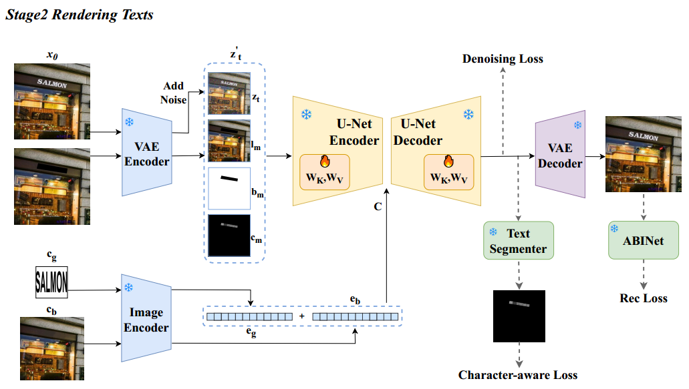
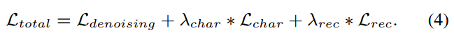

[toc]

> [First Creating Backgrounds Then Rendering Texts: A New Paradigm for Visual Text Blending](https://arxiv.org/abs/2410.10168)
>
> [official code](https://github.com/Zhenhang-Li/GlyphOnly?tab=readme-ov-file)
>
> 2024 ECAI

# 贡献

- 将 text rendering 任务拆分为了**两个子任务**（1）背景 background / 无文本图像的生成任务（2）文本生成
- 提出了一种 training-free 的**介于整张图和 mask 之间的“区域”作为输入**，通过 VAE 提升分辨率以提升小文本生成能力

# 思路

## Framework

**数据准备：**

- （1）使用 Text Removing 模型对有文本的图像进行擦除（2）使用 T2I 模型直接生成无文本的图像

**模型框架：**

- （1）原始图像（2）masked image（3）mask（4）character-level mask，**在 channel 上 concat 作为输入**

  > 借鉴了 TextDiffuser 的思路

- condition embedding / encoder hidden state 的输入来自 CLIP image encoder

  > 不太清楚 $c_g$ 和 $c_b$ 是如何对齐和融合的

**损失函数：**

- 比较特殊的是 ABINet 得到的 Rec Loss，看起来和 OCR Loss 类似

- 完整的损失函数，

  

**小文本分辨率提升：**

- 参考 Adaptive Text Block Exploration Strategy 章节，看起来主要是一个<u>*根据外接矩形的长宽按照某种自适应的比率进行放大的*算法</u>；相比整张图片输入 VAE 更关注文本部分，同时又不会像直接输入 mask region 提供的信息过少

