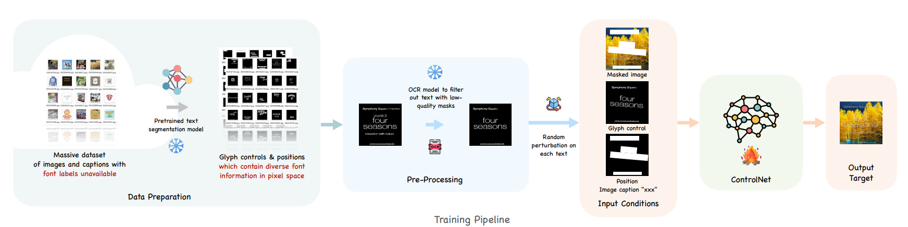

[toc]

> [ControlText: Unlocking Controllable Fonts in Multilingual Text Rendering without Font Annotations](https://arxiv.org/abs/2502.10999)
>
> [源码](https://github.com/bowen-upenn/ControlText)

# 贡献

- 在 AnyText 的基础上，将 STE 任务完整组合成了一个<u>*系统*</u>；方法上的创新不多，但整个从数据到训练到用户交互的<u>*流程*</u>可以参考

# 思路

## 数据集准备阶段 & 训练阶段

- 从大量未标注的数据中，通过预训练好的 <u>*text segmentation model*</u> 将文本提取出来，然后通过 <u>*ocr model*</u> 过滤掉置信度较低、质量较差的文本；对检测得到的 bbox 的坐标进行一定程度的<u>*偏移*</u> (i.e. 对文本进行变形、旋转 e.t.c.)

## 推理阶段

- 在 AnyText 的基础上训练

- 推理时还进行了<u>*额外的优化*</u>，

  - <u>*Inpainting Before Editing*</u>，原始文本的 bbox 可能和 target text 的长度不符合，过大的 bbox 会给模型生成不可读或多余字符的机会；论文中提出，<u>*先擦除，再生成*</u>的流程

  - <u>*Small Textual Regions*</u>

    > 没有看懂到底看了啥

# Evaluation Metric

- *<u>Fuzzy Fonts</u>*，指的是很多的字体是没有 label 的，以 label 为单位评价是很困难的事情

  该论文提出使用<u>*字体检测模型*</u> (Google Font Classifier by Storia-AI)，在 embedding 层面计算相似度 (具体的做法，是将 classifier 输出的 top-k 提取出来，其它部分置 0，<u>*对拥有 k 个元素的向量计算相似度*</u>)

  根据计算相似度的方式，<u>*分为 $l2@k$ 和 $cos @k$*</u>

  > 不是很明白为什么不直接使用 CE loss？

- Sen-ACC 
- NED