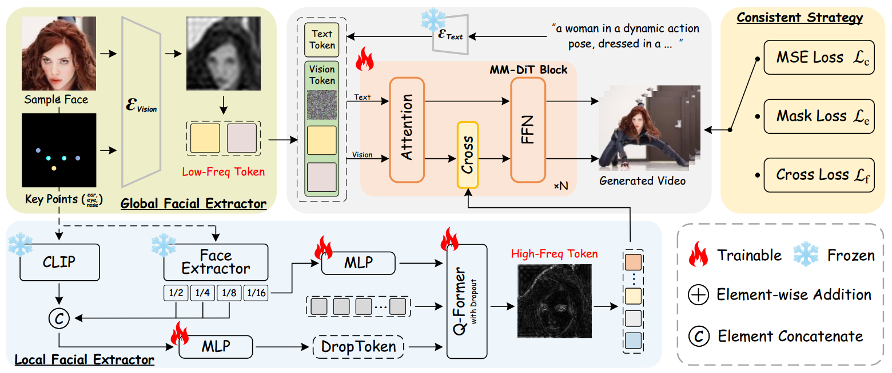

[toc]

> [Identity-Preserving Text-to-Video Generation by Frequency Decomposition](https://arxiv.org/abs/2411.17440)
>
> [源码]()
>
> CVPR 2025

# 贡献

- 将脸部特征<u>*分为低维特征*</u> (e.g. 面部比例和轮廓) 和<u>*高纬特征*</u> (e.g. 眼睛和嘴唇纹理)

- 采用<u>*粗到细的训练策略*</u>，使用<u>*动态掩码损失*</u>和<u>*动态跨人脸损失*</u>

# 思路

## Framework

**Global Facial Extractor (Low-frequency)**

- 新增<u>*面部 keypoint*</u> (e.g. ear, eye, nose) 转为 RGB 图像后作为输入 <u>*concat 在一起*</u>

**Local Facial Extractor (High-frequency )**

- 将脸部识别模型提取到的 <u>*face feature 和 CLIP image embedding 通过 QFormer 融合*</u>
- CLIP 提取到的<u>*语义信息不一定和脸部相关*</u>，应用一个 <u>*Dropout 进行过滤*</u>
- 得到的 High-Freq Token <u>*通过 cross attn 后相加融合*</u>

**Training Strategy**

- 先训练 Low-Freq，再训练 High-Freq

**损失函数**

> 按照网络结构图，以下 3 个 loss 应该是或的关系，只能选择 1 个

- $L_c$：重建损失

- $L_e$：有一定几率使用脸部部分 (segmentation mask) 的损失函数替换整个 $L_c$

- $L_f$：有一定几率<u>*输入的图像不来自于训练数据集*</u> (应该是同一个 "subject"，但是和 training set 中截取的 frames 并<u>*不连续*</u>)，并对<u>*输入图像加上高斯模糊*</u>

  可以<u>*增加模型的泛化性*</u>

# Evaluation Metric

- FaceSim-Arc 和 FaceSim-Cur：使用不同的脸部识别模型提取 feature 后计算相似度
- FID
- CLIPScore

# Ablation

- 损失函数设计有效
- 采样步数在 $t=50$ 左右效果最好