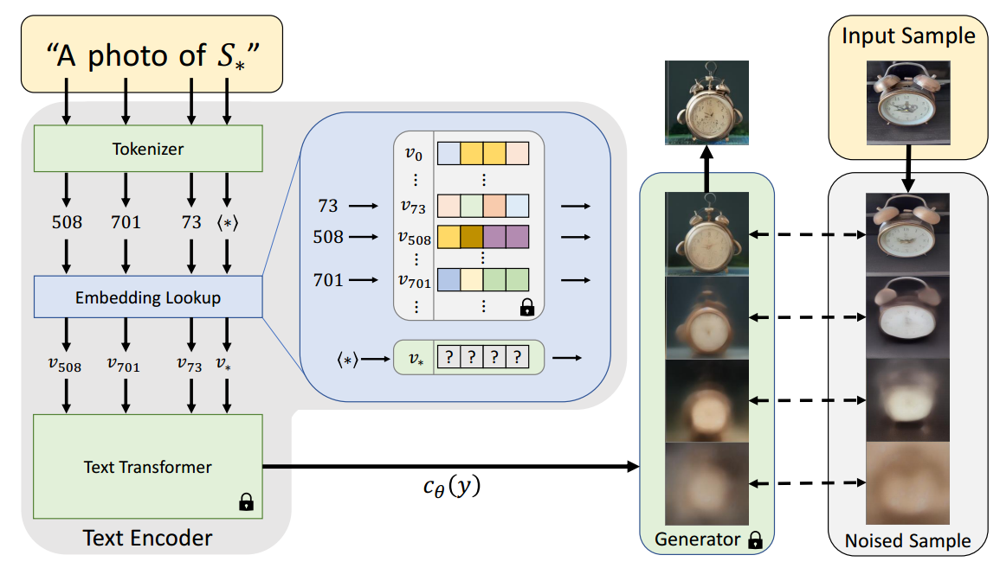

[toc]

> [An Image is Worth One Word: Personalizing Text-to-Image Generation using Textual Inversion](https://arxiv.org/abs/2208.01618)
>
> [源码](https://github.com/rinongal/textual_inversion)
>
> ICLR 2023

# 贡献

- 提出了一种<u>*仅对 pseudo-words (i.e. $S^*$) 进行训练*</u>从而引入新的 "subject" 的方法

# 思路

## Framework

- Textual Inversion 的思想，是认为模型<u>*本身就有生成某些 "subject" 的能力*</u>，只是对应的 prompt 可能不是人类常用的词汇，所以不选择训练 UNet，而是<u>*去训练 embedding*</u>
- 对 placeholder (e.g. $S^*$) 的 embedding function 进行单独的学习，然后<u>*通过替换 (记录 placeholder token 的 idx) 实现*</u>